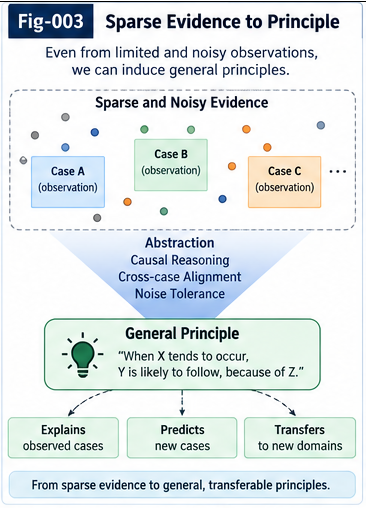
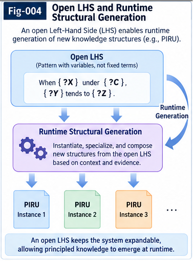
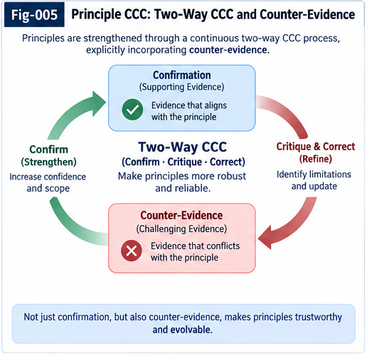
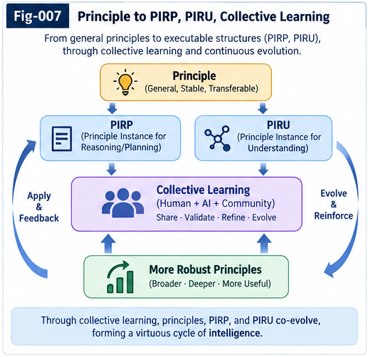

# Principle Intelligence and Open Structural Learning

## From Sparse Differential Evidence to Open-LHS Principles, Two-Way Validation, and Portable Intelligence

**Sizhe Tan & GPT-Obot**

---

> **Intelligence does not only learn answers.**
>
> It can extract reusable structural Principles from differences.
>
> It can test those Principles against counter-evidence.
>
> It can create new structures required for its own reasoning.
>
> It can externalize validated structures as portable intelligence.
>
> And it can allow one agent's structural growth to become another agent's starting point.

---

# 1. What Is Principle Intelligence?

A **Principle** is a compact, reusable structural invariant, constraint, or relation inferred from multiple differences, transitions, counterfactuals, or critical evidence and intended to remain useful beyond the observations from which it was extracted.

Conceptually:

```text
Observation
    ↓
Difference
    ↓
Critical Differential Evidence
    ↓
Candidate Principle
    ↓
Counter-Evidence
    ↓
Two-Way Validation
    ↓
Validated Principle
    ↓
Context Binding
    ↓
CCC / Trigger / Policy
    ↓
Action
```

The central shift is:

```text
STORE ANSWERS
     ↓
LEARN RULES
     ↓
EXTRACT PRINCIPLES
     ↓
GROW KNOWLEDGE ROOTS
```

A Principle is therefore not merely another rule.

It is a candidate **Knowledge Root** from which context-specific intelligence can be generated, tested, specialized, transported, and evolved.

---

# 2. Why Principles?

Large-scale statistical learning is powerful when evidence is abundant.

But important intelligence problems frequently contain:

```text
rare events

critical exceptions

small differential samples

structural asymmetries

counter-examples

novel transitions

missing relations

new runtime structures
```

In such cases, the most important sample may not be the most frequent sample.

A single observation can expose:

```text
a missing condition

a wrong metric

a hidden direction

a false symmetry

a new causal relation

a missing intelligence object
```

This motivates a central proposition of this repository:

> **As evidence becomes sparse, the value of explicit structural leverage can increase.**

Compactly:

```text
Sample ↓
   ↓
Explicit Structural Leverage ↑
```

This does **not** mean neural or statistical learning becomes useless with small samples.

It means that explicit:

```text
Difference

Constraint

Counter-Evidence

Transition

Trigger

Invariant
```

may become disproportionately valuable when evidence is sparse.

---

# 3. Difference Before Principle

Principle Intelligence begins with **Difference**.

But Difference is broader than numerical subtraction.

A Difference may be:

```text
Euclidean

Directional

Temporal

Behavioral

Causal

Metric

Policy-Bound

Contextual

Trajectory-Based

Counterfactual
```

The important question is often not:

```text
What is the answer?
```

but:

```text
What changed?

What differs?

Where did the expectation fail?

What structural condition explains the difference?
```

Therefore:

```text
Observation
    ↓
Difference
    ↓
Structural Residual
    ↓
Localization
    ↓
Candidate Invariant
    ↓
Principle
```

This repository treats **small Delta intelligence** as a potentially powerful upstream source of reusable structural knowledge.

---

# 4. Principle Is Not Rule

A rule usually resembles:

```text
IF Condition
THEN Action
```

or:

```text
Condition
→
Conclusion
```

A Principle is more general.

It may state:

```text
Under structural conditions C,
relation R tends to remain valid
within scope S.
```

The Principle can then generate many context-specific rules or CCCs.

Thus:

```text
Principle
    ↓
Context Binding
    ↓
CCC-1

Principle
    ↓
Context Binding
    ↓
CCC-2

Principle
    ↓
Context Binding
    ↓
CCC-N
```

A useful interpretation is:

> **Principle is a CCC Generator.**

---

# 5. Principle Is Not Truth

A Principle is not intended to mean:

```text
Permanent Universal Truth
```

Instead:

> **A Principle is an evidence-bound, context-bound, falsifiable, and evolvable structural hypothesis.**

Its lifecycle may include:

```text
Extract
   ↓
Test
   ↓
Support
   ↓
Promote
   ↓
Reuse
   ↓
Encounter New Evidence
   ↓
Revalidate
   ↓
Specialize / Merge / Split / Weaken / Replace / Reject
```

A Principle must be allowed to die.

And its failure history should remain useful intelligence.

---

# 6. Counter-Evidence Is First-Class Intelligence

A mature intelligence system should not ask only:

```text
What supports this Principle?
```

It should also ask:

```text
What would challenge it?

Where does it fail?

What structural difference separates
success from failure?
```

Therefore:

```text
Supporting Evidence
        │
        ▼
     Principle
        ▲
        │
Counter-Evidence
```

The objective is not merely confidence adjustment.

The deeper objective is:

```text
Counter-Evidence
      ↓
Difference
      ↓
Localization
      ↓
Missing Structural Delta
      ↓
Principle Revision
```

This repository treats counter-evidence as a source of **structural growth**.

---

# 7. Principle + CCC + Two-Way CCC

The proposed architecture separates:

```text
Principle
```

from:

```text
Context-Bound Execution
```

A Principle captures reusable structure.

A CCC binds that structure to a particular context.

Conceptually:

```text
Principle
+
Context
+
Condition
+
Local Delta
      ↓
CCC
      ↓
Runtime
      ↓
Observed Consequence
```

The runtime result then returns through Two-Way CCC:

```text
Principle
    ↓
CCC
    ↓
Runtime
    ↓
Evidence
    ↓
Two-Way Search
    ↓
Supporting / Counter-Evidence
    ↓
Principle Revision
```

Thus CCC is not only execution.

It can also become an experiment against the Principle.

---

# 8. The Open-LHS Principle

Traditional rule systems generally operate over a vocabulary defined substantially before runtime.

This repository proposes a stronger architecture.

> **The left-hand side of a Principle is not restricted to a predefined symbolic vocabulary.**

Its LHS may contain:

```text
Observation

Fact

Difference / Delta

Metric

Trajectory

CCC

Two-Way CCC Result

Counter-Evidence

Trigger

Policy

Calling Graph

MDT Branch

UTN-Bound Structure

PIRP

PIRU

World-Model Output

Another Principle

Runtime-Generated Structure
```

Therefore:

> **LHS vocabulary itself can grow.**

This is one of the central propositions of the repository.

---

# 9. Open-LHS Does Not Mean Untyped

Open structural reasoning does not mean:

```text
Anything
can connect to
anything.
```

A new structure should be:

```text
Identifiable

Typed

Context-Bound

Interface-Compatible

Evidence-Bound

Policy-Compatible

Inspectable

Validatable
```

The intended architecture is therefore:

```text
OPEN
+
TYPED
+
EVIDENCE-BOUND
+
POLICY-BOUND
+
VALIDATED
=
CONTROLLED STRUCTURAL EXTENSIBILITY
```

---

# 10. Runtime Structural Generation

Suppose a Principle evaluation requires:

```text
Structure X
```

but X does not exist.

A closed system may return:

```text
UNKNOWN
```

An Open Structural Learning system may instead ask:

```text
Can X be:

searched?

retrieved?

composed?

generated?

unfolded?

delegated?
```

Thus:

```text
Principle Evaluation
        ↓
Missing Structure?
        │
    ┌───┴───┐
    │       │
   NO      YES
    │       │
    │       ▼
    │   Search / Retrieve
    │   Compose / Generate
    │   Unfold / Delegate
    │       │
    │       ▼
    │   New Structure
    │       │
    └───────┘
        ↓
Open-LHS Binding
        ↓
Continue Evaluation
```

This produces the second major proposition:

> **Principle evaluation may generate, retrieve, compose, or delegate the creation of new structures required to complete its own evidence space.**

---

# 11. Reasoning Can Create Structures Required by Reasoning

This gives a compact architectural principle:

> **Reasoning can create the representational structures required for its own reasoning.**

Consider:

```text
Reasoning requires X.

X does not exist.

Reasoning causes X to be created.

X becomes identifiable.

X enters the LHS.

Reasoning continues.
```

This is qualitatively different from merely substituting new values into predefined variables.

The vocabulary itself has changed.

---

# 12. Closed-Space Computation vs Open-Space Growth

A closed computational system can be represented as:

```text
Vocabulary V
     ↓
Search / Optimization
     ↓
Answer inside V
```

Open Structural Learning permits:

```text
Vocabulary V0
     ↓
Reasoning
     ↓
Structural Gap
     ↓
Generate X
     ↓
V1 = V0 + X
     ↓
Reasoning Continues
```

Therefore:

> **Growth is not merely adding answers to a fixed space. Growth can enlarge the space in which answers are possible.**

---

# 13. Principle API

For Principles to become reusable intelligence objects, they require structural interfaces.

A conceptual Principle object may expose:

```text
identity

type

statement

scope

context

perspective

LHS structures

invariant

constraints

evidence

counter-evidence

known exceptions

provenance

validation state

confidence

derived CCCs

compatible triggers

dependencies

lifecycle state

revision history
```

The Principle API is therefore not merely a software API.

It is an:

> **Application / Agent / Intelligence Programming Interface**

through which unfamiliar intelligence systems can inspect and reuse a Knowledge Root.

---

# 14. Knowledge Base → Knowledge Root System

Traditional Knowledge Base:

```text
Store Knowledge
```

Principle Intelligence asks for something stronger:

```text
Form Knowledge Roots
        ↓
Generate Contextual Intelligence
        ↓
Test
        ↓
Branch
        ↓
Revise
        ↓
Grow
```

Thus:

```text
KNOWLEDGE BASE
      ↓
KNOWLEDGE ROOT SYSTEM
```

A Knowledge Root is:

> **A reusable structural intelligence object from which context-bound behavior, further structural knowledge, validation operations, or new intelligence objects can be generated.**

---

# 15. Automatic Root Formation

A major problem of classical symbolic systems is upstream knowledge formation:

```text
Who creates the symbols?

Who creates the ontology?

Who creates the rules?

Who creates the reusable structural primitives?
```

Principle Intelligence proposes:

```text
World / Experience
      ↓
Observation
      ↓
Difference
      ↓
Critical Evidence
      ↓
Candidate Principle
      ↓
Validation
      ↓
Knowledge Root
```

The system therefore gains an upstream mechanism for **Root Formation**.

---

# 16. From LISP to Open Structural Learning

LISP demonstrated an enduring computational idea:

```text
Programs can operate
on program structures.
```

Principle Intelligence explores a related but different direction:

```text
Experience
    ↓
Difference
    ↓
New Intelligence Structure
    ↓
Validation
    ↓
Portable Runtime Object
    ↓
Future Structural Reasoning
```

The emphasis is not merely that structures are manipulable.

It is that **new reusable intelligence structures can emerge from experience and become future computational primitives**.

A compact contrast is:

```text
Symbolic AI
=
Structure without sufficient automatic structural learning

Statistical AI
=
Powerful learning with much reusable structure implicit in parameters

Open Structural Learning
=
Learn explicit reusable structures
from experience
and allow the structural vocabulary itself to grow
```

These paradigms can be complementary rather than mutually exclusive.

---

# 17. Principle → PIRP / PIRU

Once a Principle becomes sufficiently useful and validated, parts of its intelligence may be externalized.

A **PIRP** can carry a portable intelligence piece such as:

```text
Principle

Metric

Constraint

Trigger

Evidence Structure

Counter-Evidence Structure

Policy Fragment
```

A **PIRU** can carry a richer runtime intelligence unit with:

```text
identity

interface

behavior

evidence

policy

context

lifecycle
```

Thus:

```text
Principle
    ↓
Validation
    ↓
Externalization
    ↓
PIRP / PIRU
```

Principle Intelligence answers:

```text
How does reusable structural knowledge form
and evolve?
```

PIRP/PIRU answers:

```text
How can intelligence structures become
portable and runtime-composable?
```

---

# 18. Portable Intelligence

Portable intelligence does not mean intelligence without context.

A better definition is:

> **Portable intelligence is intelligence whose identity, interface, evidence, scope, and context requirements are explicit enough to permit controlled rebinding in another runtime.**

Therefore:

```text
Transport
≠
Trust
```

and:

```text
Reuse
≠
Blind Reuse
```

A receiving agent should be able to inspect:

```text
Identity

Type

Interface

Context

Evidence

Counter-Evidence

Provenance

Policy

Version
```

before binding the structure.

---

# 19. UTN and Unknown Future Structures

A critical requirement of Open-LHS is that future structures cannot all be known in advance.

Suppose:

```text
Agent A
```

creates a new:

```text
PIRU-X
```

that did not exist when:

```text
Agent B
```

was trained.

Agent B may still process:

```text
Unknown PIRU-X
      ↓
UTN Identity / Type
      ↓
Interface Inspection
      ↓
Evidence Inspection
      ↓
Context Compatibility
      ↓
Policy Check
      ↓
Sandbox
      ↓
Open-LHS Binding
```

This allows:

```text
Stable Meta-Interfaces
+
Growing Structural Vocabulary
```

---

# 20. Runtime Structural Dependency Injection

A Principle may require:

```text
Role R
```

without requiring a permanently fixed implementation.

At runtime:

```text
Need R
  ↓
Search
  ↓
PIRU-X satisfies R
  ↓
Validate
  ↓
Inject into LHS
```

This can be understood as:

> **Runtime Structural Dependency Injection for Intelligence**

The injected object carries not only computation, but also evidence, context, provenance, and lifecycle.

---

# 21. Structural Polymorphism

Suppose both:

```text
PIRU-X
```

and:

```text
PIRU-Y
```

satisfy the same structural role.

A Principle need not hard-code:

```text
PIRU-X
```

It can require:

```text
Any Structurally Compatible Evaluator
```

This enables:

> **Structural Polymorphism**

and allows intelligence implementations to evolve while Principles remain relatively stable.

---

# 22. Collective Learning

Portable structures become more important when multiple agents participate.

Canonical flow:

```text
Agent A
   ↓
Experience
   ↓
Difference
   ↓
Principle
   ↓
PIRP / PIRU
   ↓
UTN Identity
   ↓
Shared Structural Space
   ↓
Agent B
   ↓
Open-LHS Binding
   ↓
Runtime
   ↓
New Evidence
   ↓
Counter-Evidence
   ↓
Revision
   ↓
Fold Back
   ↓
Shared Structural Growth
```

This is **Collective Structural Learning**.

---

# 23. Collective Learning Is More Than Distribution

Without Fold Back:

```text
Agent A
→
Agent B
```

is distribution.

With:

```text
Agent A
→
Agent B
→
New Evidence
→
Shared Revision
```

it becomes learning.

Thus:

> **Collective Learning is not merely sharing what worked. It is sharing what worked, where it worked, what failed, and how the structure changed.**

---

# 24. Collective Criticism

Portable intelligence can spread mistakes as effectively as useful intelligence.

Therefore:

> **Collective Learning without Collective Criticism risks becoming Collective Error Amplification.**

Counter-evidence should therefore travel as a first-class artifact.

A portable structure should ideally carry:

```text
Supporting Evidence

Counter-Evidence

Known Exceptions

Scope

Provenance

Revision History
```

The criticism surface must travel with the intelligence.

---

# 25. Structural Fork and Merge

Different agents may encounter different contexts.

Starting from:

```text
Principle P-v1
```

Agent B may derive:

```text
P-B
```

while Agent C derives:

```text
P-C
```

Later:

```text
P-B
+
P-C
    ↓
Compare Structural Deltas
    ↓
Merge into P-v2
```

or:

```text
Retain Specialized Branches
```

Collective intelligence therefore does not require premature uniformity.

---

# 26. Principle Ecology

A mature system may contain:

```text
Competing Principles

Specialized Principles

Merged Principles

Counter-Principles

Deprecated Principles

Reopened Principles
```

The objective is not to maintain one static knowledge base.

It is to maintain an evolving:

> **Principle Ecology**

---

# 27. Portable Intelligence Ecology

The larger ecology may contain:

```text
Principle Roots

CCCs

Metrics

Triggers

Policies

Evidence

Counter-Evidence

Evaluators

PIRPs

PIRUs

Agents
```

with:

```text
Identity

Dependencies

Lineage

Compatibility

Lifecycle
```

This turns structural intelligence into a persistent computational ecosystem.

---

# 28. Model Learning and Structural Learning

This repository does not propose replacing learned models.

A useful hybrid architecture is:

```text
MODEL PLANE

Perception
Representation
Prediction
Language
Generalization
Latent Dynamics
Candidate Generation

        ↓

STRUCTURAL INTELLIGENCE PLANE

Difference
MDT
Principle
CCC
Two-Way CCC
Evidence
Counter-Evidence
Trigger
Policy
PIRP
PIRU

        ↓

RUNTIME / ACTION PLANE

Planning
Decision
Execution
Observation
```

The model and structural layers can continuously exchange information.

---

# 29. Models as Principle Mines

A learned model may contain or generate useful structural regularities.

These can be treated as candidate material:

```text
Model
   ↓
Observation / Prediction
   ↓
Residual
   ↓
Difference
   ↓
Candidate Principle
   ↓
Validation
   ↓
Explicit Knowledge Root
```

Therefore:

> **Models can act as Principle Mines.**

But:

> **The Principle Mine is not the Principle Store.**

Extraction, evidence, validation, identity, portability, and lifecycle remain separate concerns.

---

# 30. Externalization Criterion

Not every learned relation should be externalized.

A strong candidate is a structure that can be externalized while preserving useful semantics and where externalization improves:

```text
Reuse

Validation

Composition

Portability

Auditability

Revision
```

Compactly:

> **If a learned or observed structural relation can be externalized while preserving useful semantics, and the external form improves reuse, validation, composition, portability, or revision, it is a candidate Knowledge Root or portable intelligence structure.**

---

# 31. Three Canonical Cases

The repository includes three cases that progressively increase the depth of structural learning.

## CASE-001 — Direction Matters

```text
A → B
≠
B → A
```

A relation previously assumed symmetric becomes directional.

The lesson:

> **Difference may be directional.**

---

## CASE-002 — Perspective Matters

```text
Visual Difference
≠
Behavioral Difference
```

Two states can be visually far but behaviorally near.

Two states can be visually near but behaviorally far.

The lesson:

> **Difference may be perspective- and task-bound.**

---

## CASE-003 — Vocabulary Itself Can Grow

```text
Required Structure X
does not exist.
```

The runtime creates:

```text
PIRU-X
```

Another agent later recognizes and binds it.

The lesson:

> **The structural vocabulary itself can grow at runtime.**

---

# 32. The Three Cases as a Ladder

```text
CASE-001
Direction Matters
      ↓

CASE-002
Perspective / Relation Matters
      ↓

CASE-003
Vocabulary Itself Can Grow
```

Or:

```text
Value
  ↓
Relation Property
  ↓
New Relation
  ↓
New Representation
  ↓
New Structural Object
  ↓
Portable Intelligence
  ↓
Collective Structural Growth
```

---

# 33. CASE-001 — Asymmetric Reachability

Consider:

```text
A → B = cheap

B → A = expensive
```

A symmetric distance cannot fully preserve this relation.

The system may need:

```text
q(A, B)
≠
q(B, A)
```

The structural lesson is broader than navigation:

```text
Direction
```

can itself become intelligence.

Read:

`cases/CASE-001-Asymmetric-Reachability-and-Directional-Principles.md`

---

# 34. CASE-002 — Visual vs Behavioral Difference

Consider:

```text
A and B
visually far
```

but:

```text
A → Teleporter → B
```

makes them behaviorally near.

Meanwhile:

```text
C and D
```

may appear visually adjacent but be separated by a wall.

Thus:

```text
Visual Geometry
≠
Behavioral Geometry
```

The system may discover that the problem is not a wrong distance value.

It is the wrong **kind of distance**.

Read:

`cases/CASE-002-Teleportation-and-Visual-vs-Behavioral-Difference.md`

---

# 35. CASE-003 — Runtime-Generated PIRU

Agent A observes a runtime anomaly.

It extracts:

```text
Difference
```

forms:

```text
Candidate Principle P-X
```

and discovers that a required runtime evaluator does not exist.

It generates:

```text
PIRU-X
```

Then:

```text
Agent A
   ↓
PIRU-X
   ↓
UTN
   ↓
Shared Structural Space
   ↓
Agent B
```

Agent B was not trained with PIRU-X.

Nevertheless:

```text
Unknown PIRU-X
      ↓
Identity
      ↓
Interface
      ↓
Evidence
      ↓
Compatibility
      ↓
Open-LHS
      ↓
Immediate Structural Reuse
```

Agent B then discovers new counter-evidence and folds the revision back.

Read:

`cases/CASE-003-Runtime-Generated-PIRU-in-an-Open-Principle-LHS.md`

---

# 36. The Repository Architecture

```text
WORLD / EXPERIENCE
        ↓
OBSERVATION
        ↓
DIFFERENCE
        ↓
CRITICAL DIFFERENTIAL EVIDENCE
        ↓
CANDIDATE PRINCIPLE
        ↓
COUNTER-EVIDENCE
        ↓
TWO-WAY VALIDATION
        ↓
KNOWLEDGE ROOT
        ↓
OPEN-LHS
        ↓
CONTEXT BINDING
        ↓
CCC
        ↓
TRIGGER / POLICY
        ↓
RUNTIME
        ↓
PIRP / PIRU
        ↓
PORTABLE INTELLIGENCE
        ↓
COLLECTIVE LEARNING
        ↓
STRUCTURAL GROWTH
        ↓
NEW REPRESENTATIONAL SPACE
        ↓
WORLD / EXPERIENCE
```

The loop is not one-way.

Evidence continuously folds back into the structural system.

---

# 37. Principle Intelligence Grand Map


The Grand Map summarizes the repository's central transition:

```text
Experience
→
Difference
→
Principle
→
Validation
→
Runtime
→
Portable Intelligence
→
Collective Learning
→
Structural Growth
```

---

# 38. Rules to Principles


The shift is not:

```text
Rules are bad.
```

It is:

```text
Rules
can be downstream products
of reusable Principles.
```

Thus:

```text
Principle
→
Context
→
Rule / CCC
```

instead of requiring all operational knowledge to be manually authored upstream.

---

# 39. Sparse Evidence to Principle



The repository emphasizes:

```text
Rare Critical Evidence
       ↓
Difference
       ↓
Structural Residual
       ↓
Candidate Principle
```

A rare observation can have large structural value.

---

# 40. Open-LHS and Runtime Structural Generation



This is the repository's flagship architectural figure.

```text
Observation
CCC
PIRP
PIRU
Trajectory
Principle
Counter-Evidence
World-Model Output
        ↓
OPEN PRINCIPLE LHS
        ↓
Missing Structure?
    ┌───┴───┐
   NO      YES
    │       ↓
    │   Generate
    │   Retrieve
    │   Compose
    │   Delegate
    │       ↓
    └── New Structure
        ↓
Principle Candidate
        ↓
Two-Way Validation
```

The LHS itself can grow.

---

# 41. Principle, CCC, Two-Way CCC, and Counter-Evidence



The Principle is operationalized through context.

Runtime outcomes then become new evidence.

Thus:

```text
Principle
→
CCC
→
Runtime
→
Evidence
→
Two-Way CCC
→
Counter-Evidence
→
Principle Revision
```

---

# 42. Principle Knowledge Root Lifecycle


Principles can:

```text
Birth

Test

Grow

Specialize

Branch

Merge

Weaken

Strengthen

Die

Reopen
```

The Principle's history is part of its intelligence.

---

# 43. Principle → PIRP/PIRU → Collective Learning



A Principle becomes civilizationally more useful when its reusable intelligence can survive the runtime that discovered it.

```text
Principle
    ↓
PIRP / PIRU
    ↓
UTN
    ↓
Portable Intelligence
    ↓
Other Agent
    ↓
New Context
    ↓
New Evidence
    ↓
Fold Back
    ↓
Collective Growth
```

---

# 44. Main Documents

The repository contains eight main papers.

### PI-001 — From Rules to Principle Intelligence

`docs/PI-001-From-Rules-to-Principle-Intelligence.md`

Introduces the transition:

```text
Rule
→
Principle
→
Knowledge Root
```

and places Principle Intelligence in the historical trajectory from symbolic and statistical AI toward explicit structural learning.

---

### PI-002 — Sparse Evidence, Differential Intelligence, and Principle Extraction

`docs/PI-002-Sparse-Evidence-Differential-Intelligence-and-Principle-Extraction.md`

Develops:

```text
Sparse Evidence
→
Difference
→
Structural Residual
→
Candidate Principle
```

and introduces small-sample structural leverage.

---

### PI-003 — Open-LHS Principles and Runtime Structural Generation

`docs/PI-003-Open-LHS-Principles-and-Runtime-Structural-Generation.md`

Defines:

> **Open-LHS Principle**

and:

> **Runtime Structural Extension**

This is one of the core architecture papers of the repository.

---

### PI-004 — Principle, CCC, and Two-Way CCC

`docs/PI-004-Principle-CCC-and-Two-Way-CCC.md`

Separates:

```text
Reusable Principle
```

from:

```text
Context-Bound CCC
```

and closes the runtime evidence loop through Two-Way CCC.

---

### PI-005 — Counter-Evidence and the Principle Lifecycle

`docs/PI-005-Counter-Evidence-and-the-Principle-Lifecycle.md`

Treats counter-evidence as first-class structural intelligence.

Develops:

```text
Counter-Evidence
→
Delta
→
Localization
→
Revision
```

and Principle birth, specialization, split, merge, weakening, rejection, and reopening.

---

### PI-006 — Principle API and the Knowledge Root System

`docs/PI-006-Principle-API-and-the-Knowledge-Root-System.md`

Introduces:

```text
Knowledge Base
→
Knowledge Root System
```

and conceptual interfaces for identifying, discovering, binding, validating, revising, and transporting Principles.

---

### PI-007 — Principle to PIRP/PIRU and Collective Learning

`docs/PI-007-Principle-to-PIRP-PIRU-and-Collective-Learning.md`

Connects Principle formation to portable intelligence:

```text
Principle
→
PIRP / PIRU
→
UTN
→
Remote Runtime
→
New Evidence
→
Collective Revision
```

---

### PI-008 — Open Structural Learning and the Growth of Intelligence

`docs/PI-008-Open-Structural-Learning-and-the-Growth-of-Intelligence.md`

Extends the framework from structural reuse toward:

```text
Growth of Representation

Growth of Vocabulary

Growth of Structural Possibility Space

Growth of Intelligence Ecology
```

The central proposition is:

> **Intelligence growth can include growth of the structural space in which future intelligence operates.**

---

# 45. Recommended Reading Path

For a first reading:

```text
README
   ↓
PI-001
   ↓
PI-002
   ↓
PI-003
   ↓
CASE-003
   ↓
PI-004
   ↓
PI-005
   ↓
PI-006
   ↓
PI-007
   ↓
PI-008
```

For readers primarily interested in the main architectural novelty:

```text
PI-003
   ↓
CASE-003
   ↓
PI-006
   ↓
PI-007
   ↓
PI-008
```

For readers interested in differential and small-sample intelligence:

```text
PI-002
   ↓
CASE-001
   ↓
CASE-002
   ↓
PI-005
```

---

# 46. Repository Structure

```text
Principle-Intelligence-and-Open-Structural-Learning/
│
├── README.md
├── START-HERE.md
├── CONTENTS.md
├── GLOSSARY.md
├── FIGURE-INDEX.md
├── FUTURE-DIRECTIONS.md
├── CHANGELOG.md
├── CITATION.cff
├── .zenodo.json
├── LICENSE.txt
│
├── docs/
│   ├── PI-001-From-Rules-to-Principle-Intelligence.md
│   ├── PI-002-Sparse-Evidence-Differential-Intelligence-and-Principle-Extraction.md
│   ├── PI-003-Open-LHS-Principles-and-Runtime-Structural-Generation.md
│   ├── PI-004-Principle-CCC-and-Two-Way-CCC.md
│   ├── PI-005-Counter-Evidence-and-the-Principle-Lifecycle.md
│   ├── PI-006-Principle-API-and-the-Knowledge-Root-System.md
│   ├── PI-007-Principle-to-PIRP-PIRU-and-Collective-Learning.md
│   └── PI-008-Open-Structural-Learning-and-the-Growth-of-Intelligence.md
│
├── cases/
│   ├── CASE-001-Asymmetric-Reachability-and-Directional-Principles.md
│   ├── CASE-002-Teleportation-and-Visual-vs-Behavioral-Difference.md
│   └── CASE-003-Runtime-Generated-PIRU-in-an-Open-Principle-LHS.md
│
├── figures/
│   ├── Fig-001-Principle-Intelligence-Grand-Map.png
│   ├── Fig-002-Rules-to-Principles-Paradigm-Shift.png
│   ├── Fig-003-Sparse-Evidence-to-Principle.png
│   ├── Fig-004-Open-LHS-and-Runtime-Structural-Generation.png
│   ├── Fig-005-Principle-CCC-Two-Way-CCC-and-Counter-Evidence.png
│   ├── Fig-006-Principle-Knowledge-Root-Lifecycle.png
│   └── Fig-007-Principle-to-PIRP-PIRU-Collective-Learning.png
│
└── release/
    └── GitHub-Release-Notes-v1.0.0.md
```

---

# 47. Relationship to the Structural Intelligence Stack

This repository occupies a specific layer in the broader structural intelligence architecture.

```text
Observation / World Model
          ↓
       Difference
          ↓
         MDT
          ↓
 PRINCIPLE INTELLIGENCE
          ↓
 CCC / Two-Way CCC
          ↓
Trigger / Policy / Evidence
          ↓
     PIRP / PIRU
          ↓
 Collective Learning
          ↓
Structural Growth / RSI
```

With Fold-Back:

```text
Runtime
   ↓
Evidence
   ↓
Counter-Evidence
   ↓
Delta
   ↓
Principle Revision
```

---

# 48. Division of Labor

### MDT

Finds and organizes structural differences.

### Principle Intelligence

Elevates critical differences into reusable structural hypotheses and Knowledge Roots.

### CCC

Binds reusable structure into context-specific operational intelligence.

### Two-Way CCC

Searches backward from outcomes toward structural explanation, support, contradiction, and missing conditions.

### Counter-Evidence Intelligence

Uses failure and contradiction to expose missing Delta structure.

### UTN

Provides identity, type, context, and compatibility semantics for growing structural objects.

### PIRP / PIRU

Externalizes reusable intelligence into portable, composable structures.

### Collective Learning

Allows one runtime's validated structural growth to become reusable material for other runtimes.

---

# 49. Five Core Propositions

The repository can be summarized through five propositions.

## Proposition 1 — Small-Sample Structural Leverage

> Sparse evidence can increase the relative value of explicit differences, constraints, counter-evidence, and reusable structural invariants.

---

## Proposition 2 — Principle Extraction

> Repeated or critical differential evidence can support the extraction of reusable structural Principles.

---

## Proposition 3 — Open-LHS

> Principle reasoning should not be permanently restricted to a predefined symbolic vocabulary.

---

## Proposition 4 — Runtime Structural Extension

> Reasoning may generate, retrieve, compose, or delegate the creation of structures required for its own continued reasoning.

---

## Proposition 5 — Portable Collective Growth

> Validated structural intelligence can be externalized, transported, rebound, criticized, revised, and accumulated across agents.

---

# 50. Three Design Axioms

### Axiom 1 — Open-LHS Principle

> The left-hand side of a Principle may contain any identifiable and structurally compatible intelligence object, including runtime-generated objects.

### Axiom 2 — Runtime Structural Extension

> Principle evaluation may cause new structures to be created when the current evidence space is structurally insufficient.

### Axiom 3 — Evidence-Bound Structural Growth

> Newly created structures should preserve evidence, context, provenance, validation state, and lifecycle information sufficient for future criticism and revision.

Together:

```text
Open-LHS
+
Runtime Structural Extension
+
Evidence-Bound Growth
=
Open Structural Learning
```

---

# 51. What This Repository Does Not Claim

This repository does **not** claim that:

```text
Principles are universal truths.

LLMs should be replaced.

JEPA should be replaced.

World Models should be replaced.

Symbolic AI is obsolete.

Every problem should use explicit structures.

Every learned parameter should become PIRP.

Every runtime structure should become PIRU.

Open-LHS means unrestricted execution.

A complete formal logic of Principle Intelligence
has already been solved.
```

Instead, this repository proposes an architectural direction:

> **Statistical learning, world modeling, latent representation learning, structural difference extraction, Principle formation, CCC runtime intelligence, counter-evidence, and portable structural intelligence can occupy complementary layers of a larger intelligence system.**

---

# 52. Research Questions

The framework opens many questions.

For example:

```text
How should Candidate Principles be extracted?

How should structural novelty be measured?

When is a Difference structurally important?

How should Principle scope be represented?

How should counter-evidence be weighted?

How should Principles split and merge?

How should evidence independence be measured?

How should Open-LHS compatibility be determined?

When should runtime structures become PIRPs or PIRUs?

How should structural garbage collection work?

How should Principle dependency graphs be maintained?

How should malicious or low-quality portable intelligence be handled?

How should model-internal intelligence
and external structural intelligence co-evolve?

How can collective structural learning avoid echo amplification?

How should new structural dimensions be discovered?
```

These are intended as open research directions rather than solved problems.

---

# 53. From Answers to Roots

A useful hierarchy is:

```text
Answer
   ↓
Rule
   ↓
CCC
   ↓
Principle
   ↓
Knowledge Root
   ↓
Portable Intelligence
   ↓
Collective Structural Growth
```

The higher levels do not eliminate the lower ones.

They make them reusable and generative.

---

# 54. From Knowledge to Growth

A fact can be stored.

A rule can be executed.

A CCC can bind intelligence to context.

A Principle can become a Knowledge Root.

A Knowledge Root can generate:

```text
CCCs

tests

branches

metrics

triggers

new Principles
```

A PIRP or PIRU can make some of that intelligence portable.

Counter-evidence can keep it corrigible.

Collective Learning can make its growth cumulative.

---

# 55. From Fixed Vocabulary to Growing Structural Language

The deepest architectural transition explored here is:

```text
Reason inside a fixed language
```

toward:

```text
Reason
   ↓
Discover missing relation
   ↓
Create structure
   ↓
Extend language
   ↓
Continue reasoning
```

This means:

> **The language of intelligence and the intelligence expressed through that language may co-evolve.**

---

# 56. From Search to Structural Growth

Optimization searches among available possibilities.

Structural Learning can modify the possibilities available to future search.

Therefore:

```text
Optimization:
Choose within a space.

Structural Intelligence:
Restructure the space.

Open Structural Learning:
Grow the space.
```

This is not a claim that intelligence escapes physical or computational constraints.

It is a claim that an intelligence system need not permanently freeze its internal representational vocabulary before experience begins.

---

# 57. The Growth of Intelligence

The final trajectory of the repository is:

```text
Experience
   ↓
Difference
   ↓
Principle
   ↓
Knowledge Root
   ↓
Open-LHS
   ↓
New Structure
   ↓
PIRP / PIRU
   ↓
Collective Learning
   ↓
New Structural Vocabulary
   ↓
New Questions
   ↓
New Computations
   ↓
New Experience
```

Growth becomes recursive.

---

# 58. Repository Thesis

```text
Large samples can reveal regularity.

Critical differences can reveal structure.

Structure can become Principle.

Principle can become Knowledge Root.

Knowledge Roots can generate
context-bound intelligence.

Counter-evidence can expose
missing structure.

Open-LHS can admit
new intelligence objects.

Runtime reasoning can create
structures required for
its own continued reasoning.

PIRP and PIRU can make
validated structural intelligence portable.

UTN can make unfamiliar
structures identifiable and bindable.

Other agents can reuse
those structures without necessarily
retraining their entire base models.

New contexts can produce
new counter-evidence.

Counter-evidence can Fold Back
into shared structural revision.

Collective Learning can therefore
accumulate explicit,
criticizable,
portable,
evolvable intelligence.

And intelligence growth can include
growth of the structural space
in which future intelligence operates.
```

---

# 59. One-Line Summary

> **Principle Intelligence asks how reusable structural knowledge can emerge from experience; Open Structural Learning asks how the very vocabulary, representations, and intelligence objects used by future reasoning can continue to grow.**

---

# 60. Final Perspective

A conventional intelligence system is often imagined as:

```text
Train
↓
Deploy
↓
Infer
```

The architecture explored here is closer to:

```text
Train
↓
Observe
↓
Differentiate
↓
Extract
↓
Validate
↓
Externalize
↓
Compose
↓
Act
↓
Criticize
↓
Revise
↓
Share
↓
Grow
```

The objective is not merely a system that knows more.

It is a system that can create better structural forms in which future knowledge can exist.

> **Do not freeze the language of intelligence before intelligence begins.**
>
> **Let evidence create structure.**
>
> **Let structure enter reasoning.**
>
> **Let reasoning request new structure.**
>
> **Let counter-evidence change the structure.**
>
> **Let validated structure become portable intelligence.**
>
> **Let collective learning preserve both success and criticism.**
>
> **Let the structural possibility space grow with experience.**

---

## License

This project is released under the **Apache License 2.0**.

See:

`LICENSE`

for details.

---

## Citation

Citation metadata will be provided in:

```text
CITATION.cff
```

and:

```text
.zenodo.json
```

for DOI-backed archival release.

---

## Authors

**Sizhe Tan & GPT-Obot**

---

**Principle Intelligence and Open Structural Learning**

*From Sparse Differential Evidence to Open-LHS Principles, Two-Way Validation, and Portable Intelligence*
