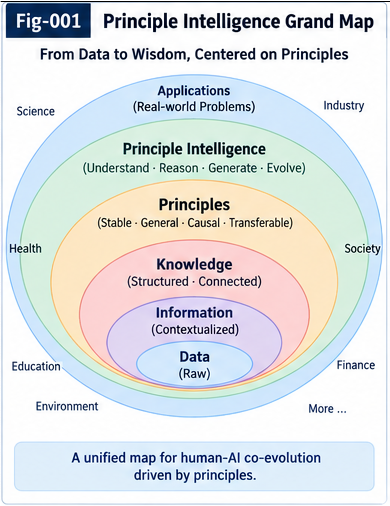

# START HERE

## Principle Intelligence and Open Structural Learning

### From Sparse Differential Evidence to Open-LHS Principles, Two-Way Validation, and Portable Intelligence

**Sizhe Tan & GPT-Obot**

---

# 1. If You Have Only 60 Seconds

This repository studies one central question:

> **Can an intelligent system learn not only answers and parameters, but new reusable structural Principles—and even new intelligence structures required for its own future reasoning?**

The proposed path is:

```text
Experience
    ↓
Difference
    ↓
Critical Differential Evidence
    ↓
Candidate Principle
    ↓
Counter-Evidence
    ↓
Two-Way Validation
    ↓
Knowledge Root
    ↓
Open-LHS
    ↓
Runtime Structural Generation
    ↓
PIRP / PIRU
    ↓
Collective Learning
    ↓
Open Structural Growth
```

The key idea is not merely:

```text
Learn more knowledge.
```

It is:

```text
Learn new reusable structures
in which future knowledge
and reasoning can operate.
```

---



**Fig-001 — Principle Intelligence Grand Map.**  
The overall architecture of Principle Intelligence and Open Structural Learning, from differential evidence and Principle formation to Open-LHS, portable intelligence, Collective Learning, and structural growth.

---

# 2. The Four Ideas to Remember

If you remember only four ideas from this repository, remember these.

## Idea 1 — Difference Can Produce Principle

Sparse but structurally important evidence can reveal:

```text
Difference
    ↓
Invariant
    ↓
Candidate Principle
```

A rare observation may matter more than thousands of ordinary observations if it exposes a missing structural relation.

---

## Idea 2 — Principle Is a Knowledge Root

A Principle is not merely:

```text
IF X
THEN Y
```

It is a reusable structural relation that can generate many context-bound CCCs:

```text
Principle
    ↓
Context A
    ↓
CCC-A

Principle
    ↓
Context B
    ↓
CCC-B
```

Therefore:

> **Principle is a CCC Generator.**

---

## Idea 3 — The LHS Can Grow

A Principle does not need to operate only over a permanently predefined symbolic vocabulary.

Its LHS may contain:

```text
Observation
Difference
Metric
Trajectory
CCC
Principle
Counter-Evidence
Trigger
Policy
Calling Graph
PIRP
PIRU
Runtime-Generated Structure
```

Therefore:

> **LHS vocabulary itself can grow.**

---

## Idea 4 — Intelligence Can Become Portable

A validated Principle or derived structural capability may be externalized as:

```text
PIRP
```

or:

```text
PIRU
```

and reused by another compatible runtime.

That runtime can produce new evidence and Fold Back the resulting structural revision.

Thus:

```text
Individual Structural Learning
        ↓
Portable Intelligence
        ↓
Collective Structural Learning
```

---

# 3. What Is a Principle?

In this repository:

> **A Principle is a compact, reusable structural invariant, constraint, or relation inferred from multiple differences, transitions, counterfactuals, or critical evidence, intended to remain useful beyond the observations from which it was extracted.**

A Principle is therefore neither:

```text
a raw observation
```

nor:

```text
a permanent universal truth.
```

It is an:

> **Evidence-bound, context-bound, falsifiable, evolvable structural hypothesis.**

---

# 4. Principle vs Rule vs CCC

The distinction is important.

## Rule

```text
Condition
→
Action / Conclusion
```

A Rule is primarily operational.

---

## CCC

```text
Context
+
Condition
→
Consequence
```

A CCC binds intelligence to a specific context.

---

## Principle

```text
Reusable Structural Relation
```

A Principle can generate many CCCs after context binding.

Therefore:

```text
Principle
    ↓
Context Binding
    ↓
CCC
    ↓
Runtime
```

---

# 5. Where Does the Principle Come From?

This is one of the central problems of the repository.

Traditional systems often assume useful knowledge structures already exist.

Someone provides:

```text
symbols

rules

ontology

functions

operators
```

Principle Intelligence asks:

> **Can reusable structural knowledge itself be extracted from experience?**

The proposed path is:

```text
Observation
    ↓
Difference
    ↓
Structural Residual
    ↓
Localization
    ↓
Critical Differential Evidence
    ↓
Candidate Principle
```

This is **Root Formation**.

---

# 6. Why Difference?

Suppose a system expects:

```text
A
→
B
```

but observes:

```text
A
→
C
```

The important intelligence may lie in:

```text
Expected
vs
Observed
```

rather than in either observation alone.

The system asks:

```text
What changed?

What differs?

What missing condition explains
the difference?
```

This is the beginning of structural learning.

---

# 7. Small-Sample Structural Leverage

Large datasets are powerful for discovering statistical regularities.

But some important structures appear through:

```text
rare events

critical exceptions

counterexamples

unexpected transitions

boundary cases
```

Therefore:

```text
Sample Frequency
≠
Structural Importance
```

A rare sample can expose:

```text
a hidden direction

a missing condition

a wrong metric

a false symmetry

a new structural dimension
```

Hence the repository proposes:

> **As evidence becomes sparse, the value of explicit structural leverage can increase.**

Compactly:

```text
Sample ↓
   ↓
Explicit Structural Leverage ↑
```

---

# 8. Principle Is Not Truth

Suppose evidence supports:

```text
Principle P
```

The system should not conclude:

```text
P = permanent truth
```

Instead P enters a lifecycle:

```text
Candidate
    ↓
Tested
    ↓
Supported
    ↓
Promoted
    ↓
Applied
    ↓
Challenged
    ↓
Revalidated
```

Possible outcomes include:

```text
Strengthen

Specialize

Split

Merge

Weaken

Replace

Reject

Archive

Reopen
```

A Principle must remain corrigible.

---

# 9. Counter-Evidence Is Part of the Principle

A mature Principle should carry both:

```text
Supporting Evidence
```

and:

```text
Counter-Evidence
```

because the important question is not merely:

```text
Does P work?
```

but:

```text
Where does P work?

Where does P fail?

What structural Delta
separates the two?
```

Thus:

```text
Counter-Evidence
      ↓
Difference
      ↓
Localization
      ↓
Missing Delta
      ↓
Principle Revision
```

Counter-evidence is therefore a source of intelligence.

---

# 10. Two-Way CCC

Principles become operational through CCCs.

Forward:

```text
Principle
+
Context
    ↓
CCC
    ↓
Runtime
    ↓
Outcome
```

But runtime evidence should also travel backward:

```text
Outcome
    ↓
Why?
    ↓
Supporting Structure?
Counter-Evidence?
Alternative Cause?
Missing Condition?
    ↓
Principle Revision
```

This is the role of **Two-Way CCC**.

---

# 11. CCC Is Also an Experiment

A CCC does more than execute a Principle.

It exposes the Principle to reality.

Therefore:

```text
Principle
    ↓
CCC
    ↓
Runtime
    ↓
Evidence
```

can be understood as:

```text
Structural Hypothesis
    ↓
Contextual Experiment
    ↓
Observed Result
```

Runtime becomes part of the learning loop.

---

# 12. The Major Step: Open-LHS

Now comes the central architectural shift.

Traditional reasoning usually assumes that the objects allowed inside a rule are already known.

For example:

```text
A
+
B
+
C
→
D
```

The values of A, B, and C may change.

But the structural vocabulary is mostly fixed.

Open-LHS removes that restriction.

---

# 13. Open-LHS Principle

> **The left-hand side of a Principle is not restricted to a predefined symbolic vocabulary.**

Possible LHS objects include:

```text
Observation

Fact

Difference

Metric

Trajectory

CCC

Two-Way CCC Result

Counter-Evidence

Trigger

Policy

Calling Graph

MDT Branch

Another Principle

PIRP

PIRU

World-Model Output

Runtime-Generated Structure
```

The LHS becomes:

> **An open, extensible, runtime-constructible structural evidence space.**

---

# 14. Open Does Not Mean Uncontrolled

Open-LHS does not mean:

```text
Anything
+
Anything
=
Valid Reasoning
```

A new structure should be:

```text
Identifiable

Typed

Context-Compatible

Interface-Compatible

Evidence-Bound

Policy-Compatible

Inspectable

Validatable
```

Therefore:

```text
Open
+
Typed
+
Evidence-Bound
+
Policy-Bound
+
Validated
=
Controlled Structural Extensibility
```

---

# 15. What If the Required Structure Does Not Exist?

Suppose a Principle requires:

```text
Structure X
```

but:

```text
X does not exist.
```

The system reaches:

```text
Structural Sufficiency:
INSUFFICIENT
```

A closed system may stop.

An Open Structural Learning system can continue.

---

# 16. Runtime Structural Generation

The runtime asks:

```text
Can X be:

searched?

retrieved?

composed?

generated?

unfolded?

delegated?
```

Thus:

```text
Principle Evaluation
        ↓
Missing Structure?
        │
     YES
        ↓
Search
Retrieve
Compose
Generate
Unfold
Delegate
        ↓
Candidate Structure X
        ↓
Identity / Type
        ↓
Evidence
        ↓
Validation
        ↓
Open-LHS Binding
        ↓
Continue Reasoning
```

---

# 17. The Key Sentence

This leads to one of the repository's strongest propositions:

> **Reasoning can create the representational structures required for its own reasoning.**

Compactly:

```text
Reasoning needs X.

X does not exist.

Reasoning causes X to exist.

X enters reasoning.

Reasoning continues.
```

---

# 18. Why This Is More Than Dynamic Data

Dynamic data changes:

```text
Temperature = 25
```

to:

```text
Temperature = 30
```

The variable:

```text
Temperature
```

already existed.

Open Structural Learning permits:

```text
Vocabulary V0
```

to become:

```text
V1 = V0 + X
```

where X itself is a new structural object.

That is a different kind of growth.

---

# 19. Closed-Space Computation

Traditional computation often resembles:

```text
Define World
    ↓
Define Vocabulary
    ↓
Define Operators
    ↓
Compute
```

The system searches within the defined space.

---

# 20. Open-Space Growth

The architecture explored here allows:

```text
Enter World
    ↓
Encounter Novelty
    ↓
Extract Difference
    ↓
Discover Structural Gap
    ↓
Create New Structure
    ↓
Extend Representation
    ↓
Continue Acting
```

The system can alter the structural space in which subsequent computation occurs.

---

# 21. Knowledge Base vs Knowledge Root System

A Knowledge Base asks:

```text
What knowledge do we have?
```

A Knowledge Root System also asks:

```text
Where did this structure come from?

What evidence supports it?

What contradicts it?

What can it generate?

What depends on it?

How can it evolve?
```

Therefore:

```text
Knowledge Base
     ↓
Knowledge Root System
```

---

# 22. What Is a Knowledge Root?

A Knowledge Root is:

> **A reusable structural intelligence object from which context-bound behavior, further structural knowledge, validation operations, or new intelligence objects can be generated.**

A Principle is a natural candidate.

From one Principle may grow:

```text
CCC

Trigger

Metric

Test

Counter-Evidence Search

Specialized Principle

PIRP

PIRU
```

---

# 23. Principle API

For unfamiliar runtimes to use a Principle, the Principle should expose structural metadata.

Conceptually:

```text
Principle {
    identity
    type
    statement
    scope
    context
    perspective
    lhs_structures
    invariant
    constraints
    evidence
    counter_evidence
    exceptions
    provenance
    validation_state
    dependencies
    derived_CCCs
    lifecycle_state
    revision_history
}
```

The API is not limited to REST or software calls.

It is an:

> **Application / Agent / Intelligence Programming Interface.**

---

# 24. Principle → PIRP / PIRU

A validated structural discovery may be externalized.

## PIRP

A **Portable Intelligence Runtime Piece** may contain a reusable piece such as:

```text
Principle

Metric

Constraint

Trigger

Evidence Structure

Policy Fragment
```

## PIRU

A **Portable Intelligence Runtime Unit** may additionally contain:

```text
identity

interface

behavior

evidence

policy

context

lifecycle
```

and perform runtime computation.

---

# 25. Why Portability Matters

Without portability:

```text
Agent A learns X.

Agent B must rediscover X.
```

With portability:

```text
Agent A learns X.

Agent B can begin from X.
```

This creates a path toward cumulative structural intelligence.

---

# 26. Transport Is Not Trust

Portable intelligence should not mean:

```text
Receive X
→
Trust X
```

Instead:

```text
Receive X
    ↓
Identify
    ↓
Inspect
    ↓
Check Evidence
    ↓
Check Context
    ↓
Check Policy
    ↓
Sandbox
    ↓
Validate
    ↓
Bind
```

Thus:

> **Transport ≠ Trust**

and:

> **Reuse ≠ Blind Reuse**

---

# 27. UTN

Unknown future structures require identity and typing.

Conceptually:

```text
New Structure
    ↓
UTN Identity
    ↓
Type
    ↓
Context
    ↓
Structural Role
    ↓
Interface
    ↓
Compatibility
```

This allows a runtime to process a structure that did not exist when the runtime's base model was trained.

---

# 28. The Most Important CASE

The clearest demonstration is:

`cases/CASE-003-Runtime-Generated-PIRU-in-an-Open-Principle-LHS.md`

The case begins:

```text
Agent A
    ↓
Runtime Anomaly
    ↓
Difference
    ↓
Candidate Principle
    ↓
Missing Structural Role
```

The required intelligence object does not exist.

Agent A creates:

```text
PIRU-X
```

---

# 29. PIRU-X

PIRU-X receives:

```text
Identity

Type

Interface

Behavior

Context

Evidence

Provenance

Validation State

Policy

Lifecycle
```

It is tested and then externalized.

---

# 30. Agent B Has Never Seen PIRU-X

Agent B was trained before PIRU-X existed.

Therefore:

```text
PIRU-X
∉
Agent B's original vocabulary
```

But Agent B can perform:

```text
Unknown PIRU-X
      ↓
UTN Recognition
      ↓
Interface Inspection
      ↓
Evidence Inspection
      ↓
Structural Compatibility
      ↓
Sandbox
      ↓
Open-LHS Binding
```

PIRU-X now participates in Agent B's reasoning.

---

# 31. The Vocabulary Has Grown

Before:

```text
Vocabulary V0
```

After:

```text
Vocabulary V1
=
V0
+
PIRU-X
```

PIRU-X is not merely:

```text
new data
```

It is:

```text
a new intelligence-bearing structural object.
```

---

# 32. Agent B Can Improve Agent A's Intelligence

Suppose Agent B finds:

```text
Counter-Evidence E
```

The system extracts:

```text
Delta
```

and revises:

```text
Principle P
```

and possibly:

```text
PIRU-X
```

Then:

```text
Agent B
    ↓
New Evidence
    ↓
Revision
    ↓
Fold Back
    ↓
Shared Structural Space
```

Agent A's discovery has become collectively evolvable intelligence.

---

# 33. Collective Structural Learning

The complete loop is:

```text
Agent A
    ↓
Experience
    ↓
Principle
    ↓
PIRP / PIRU
    ↓
Portable Intelligence
    ↓
Agent B
    ↓
New Context
    ↓
Open-LHS
    ↓
Runtime
    ↓
New Evidence
    ↓
Counter-Evidence
    ↓
Revision
    ↓
Fold Back
    ↓
Collective Growth
```

This is the repository's proposed path toward **Collective Structural Learning**.

---

# 34. Collective Criticism

Sharing successful structures is not enough.

If only positive evidence travels:

```text
Portable Intelligence
    ↓
Repeated Reuse
    ↓
Apparent Confirmation
```

errors may amplify.

Therefore:

> **Collective Learning requires Collective Criticism.**

Portable intelligence should preserve:

```text
supporting evidence

counter-evidence

scope boundaries

exceptions

provenance

revision history
```

---

# 35. Three Cases in Five Minutes

The repository contains three deliberately simple cases.

## CASE-001

```text
A → B
≠
B → A
```

Lesson:

> **Direction Matters**

Read:

`cases/CASE-001-Asymmetric-Reachability-and-Directional-Principles.md`

---

## CASE-002

```text
Visual Difference
≠
Behavioral Difference
```

Lesson:

> **Perspective Matters**

Read:

`cases/CASE-002-Teleportation-and-Visual-vs-Behavioral-Difference.md`

---

## CASE-003

```text
Required Structure X
does not exist.
```

The runtime creates X and another agent later uses it.

Lesson:

> **The Vocabulary Itself Can Grow**

Read:

`cases/CASE-003-Runtime-Generated-PIRU-in-an-Open-Principle-LHS.md`

---

# 36. The Three-Case Ladder

```text
CASE-001
Direction Matters
      ↓
A relation acquires
a new property.

CASE-002
Perspective Matters
      ↓
The system acquires
a new relation.

CASE-003
Vocabulary Can Grow
      ↓
The system acquires
a new intelligence object.
```

This progression is central to understanding the repository.

---

# 37. The Seven Figures

The repository includes seven primary figures.

### Fig-001 — Principle Intelligence Grand Map

`figures/Fig-001-Principle-Intelligence-Grand-Map.png`

The complete architecture.

---

### Fig-002 — Rules to Principles Paradigm Shift

`figures/Fig-002-Rules-to-Principles-Paradigm-Shift.png`

From manually supplied operational rules toward learned reusable structural Principles.

---

### Fig-003 — Sparse Evidence to Principle

`figures/Fig-003-Sparse-Evidence-to-Principle.png`

How critical differential evidence can become reusable structure.

---

### Fig-004 — Open-LHS and Runtime Structural Generation

`figures/Fig-004-Open-LHS-and-Runtime-Structural-Generation.png`

The flagship figure.

```text
Existing Structures
        ↓
Open-LHS
        ↓
Missing Structure?
        ↓
Generate / Retrieve / Compose / Delegate
        ↓
New Structure
        ↓
Continue Principle Evaluation
```

---

### Fig-005 — Principle, CCC, Two-Way CCC, and Counter-Evidence

`figures/Fig-005-Principle-CCC-Two-Way-CCC-and-Counter-Evidence.png`

The execution-validation-revision loop.

---

### Fig-006 — Principle Knowledge Root Lifecycle

`figures/Fig-006-Principle-Knowledge-Root-Lifecycle.png`

Principle birth, validation, specialization, branching, merging, weakening, replacement, and reopening.

---

### Fig-007 — Principle to PIRP/PIRU and Collective Learning

`figures/Fig-007-Principle-to-PIRP-PIRU-Collective-Learning.png`

How structural intelligence leaves one runtime and becomes material for collective growth.

---

# 38. The Eight Main Papers

## PI-001

`docs/PI-001-From-Rules-to-Principle-Intelligence.md`

Start here for the conceptual transition from Rules to Principles.

---

## PI-002

`docs/PI-002-Sparse-Evidence-Differential-Intelligence-and-Principle-Extraction.md`

Read this for Difference, structural residuals, sparse evidence, and Principle Extraction.

---

## PI-003

`docs/PI-003-Open-LHS-Principles-and-Runtime-Structural-Generation.md`

Read this for the repository's central architectural novelty:

```text
Open-LHS
+
Runtime Structural Generation
```

---

## PI-004

`docs/PI-004-Principle-CCC-and-Two-Way-CCC.md`

Read this for Principle → CCC → Runtime → Two-Way validation.

---

## PI-005

`docs/PI-005-Counter-Evidence-and-the-Principle-Lifecycle.md`

Read this for counter-evidence, Principle revision, lifecycle, and Principle Ecology.

---

## PI-006

`docs/PI-006-Principle-API-and-the-Knowledge-Root-System.md`

Read this for the Principle API and transition:

```text
Knowledge Base
→
Knowledge Root System
```

---

## PI-007

`docs/PI-007-Principle-to-PIRP-PIRU-and-Collective-Learning.md`

Read this for portable intelligence, UTN, cross-agent reuse, and Collective Learning.

---

## PI-008

`docs/PI-008-Open-Structural-Learning-and-the-Growth-of-Intelligence.md`

Read this for the larger consequence:

```text
Growth of Answers
      ↓
Growth of Structures
      ↓
Growth of Representational Space
```

---

# 39. Recommended 15-Minute Path

If you have approximately 15 minutes:

```text
START-HERE
    ↓
Fig-001
    ↓
Fig-004
    ↓
CASE-003
    ↓
PI-003
    ↓
PI-008
```

This path gives the fastest view of the repository's distinctive contribution.

---

# 40. Recommended Theory Path

For conceptual foundations:

```text
PI-001
    ↓
PI-002
    ↓
PI-003
    ↓
PI-004
    ↓
PI-005
    ↓
PI-006
    ↓
PI-007
    ↓
PI-008
```

---

# 41. Recommended Runtime Path

For readers interested in runtime architecture:

```text
PI-003
    ↓
PI-004
    ↓
CASE-003
    ↓
PI-006
    ↓
PI-007
```

Focus on:

```text
Open-LHS

Structural Sufficiency

Runtime Structural Generation

UTN

PIRP / PIRU

Two-Way Validation

Fold Back
```

---

# 42. Recommended Differential Intelligence Path

For readers interested in sparse evidence and Difference:

```text
PI-002
    ↓
CASE-001
    ↓
CASE-002
    ↓
PI-005
```

Focus on:

```text
Difference

Structural Residual

Directionality

Perspective

Counter-Evidence Delta

Localization
```

---

# 43. Recommended Collective Learning Path

For readers interested in portable and collective intelligence:

```text
PI-006
    ↓
PI-007
    ↓
CASE-003
    ↓
PI-008
```

Focus on:

```text
Knowledge Root

Principle API

UTN

PIRP

PIRU

Portable Evidence

Collective Criticism

Structural Fork / Merge

Collective Growth
```

---

# 44. Where This Fits in the Structural Intelligence Stack

```text
Observation / World Model
          ↓
       Difference
          ↓
         MDT
          ↓
 PRINCIPLE INTELLIGENCE
          ↓
 CCC / Two-Way CCC
          ↓
Trigger / Policy / Evidence
          ↓
     PIRP / PIRU
          ↓
 Collective Learning
          ↓
Structural Growth / RSI
```

Principle Intelligence occupies the layer between:

```text
Difference Extraction
```

and:

```text
Context-Bound Operational Intelligence
```

It converts structural evidence into reusable Knowledge Roots.

---

# 45. Division of Labor

## Difference / MDT

Find:

```text
What changed?
```

---

## Principle Intelligence

Ask:

```text
What reusable structure
does the difference reveal?
```

---

## CCC

Ask:

```text
What does this Principle
mean in this context?
```

---

## Two-Way CCC

Ask:

```text
Does reality support
the structural explanation?
```

---

## Counter-Evidence

Ask:

```text
Where does it fail,
and what Delta explains the failure?
```

---

## PIRP / PIRU

Ask:

```text
Can this intelligence
be externalized and reused?
```

---

## Collective Learning

Ask:

```text
Can another runtime
use, criticize, and improve it?
```

---

# 46. Model Learning and Structural Learning Are Complementary

This repository does not propose:

```text
Principle Intelligence
instead of
LLM / JEPA / World Model
```

A more useful architecture is:

```text
Learned Model
      ↓
Observation / Prediction
      ↓
Difference
      ↓
Principle
      ↓
Structural Runtime
```

and also:

```text
Structural Runtime
      ↓
New Evidence
      ↓
Model / Principle Update
```

Different forms of intelligence can cooperate.

---

# 47. Model Plane

The Model Plane may retain:

```text
Perception

Representation

Prediction

Latent Dynamics

Language

Generalization

Candidate Generation
```

These capabilities may remain naturally distributed in learned parameters.

---

# 48. Structural Intelligence Plane

The Structural Intelligence Plane may externalize:

```text
Difference

Principle

Metric

Constraint

CCC

Counter-Evidence

Trigger

Policy

PIRP

PIRU
```

when explicit representation improves:

```text
reuse

validation

composition

portability

auditability

revision
```

---

# 49. Externalize What Benefits from Being Explicit

The proposal is not:

```text
Externalize Everything
```

but:

> **Externalize reusable intelligence when explicit structure preserves useful semantics and improves reuse, validation, composition, portability, or revision.**

Some intelligence should remain inside model parameters.

Some can become explicit structural intelligence.

---

# 50. The Core Runtime Loop

The repository can be reduced to this loop:

```text
WORLD
  ↓
Observation
  ↓
Difference
  ↓
Principle
  ↓
Context Binding
  ↓
CCC
  ↓
Runtime
  ↓
Evidence
  ↓
Two-Way Search
  ↓
Counter-Evidence
  ↓
Delta
  ↓
Principle Revision
  ↓
Portable Structure
  ↓
Other Runtime
  ↓
WORLD
```

---

# 51. The Open Runtime Loop

With Open-LHS:

```text
Principle
    ↓
Evaluate LHS
    ↓
Sufficient?
  ┌─┴─┐
 YES  NO
  │    ↓
  │  Missing Structure
  │    ↓
  │  Search / Generate
  │    ↓
  │  New Structure
  │    ↓
  └── Bind
       ↓
    Evaluate
```

The evaluation process can therefore change the space of structures available to itself.

---

# 52. The Collective Runtime Loop

```text
Agent A
   ↓
Principle
   ↓
PIRU-X
   ↓
Shared Structural Space
   ↓
Agent B
   ↓
Open-LHS
   ↓
Runtime
   ↓
Counter-Evidence
   ↓
PIRU-X'
   ↓
Principle'
   ↓
Fold Back
```

This is a minimal model of cumulative machine structural learning.

---

# 53. Five Questions to Carry Through the Repository

While reading, keep asking:

### Question 1

```text
Where did this structure come from?
```

### Question 2

```text
What Difference made it visible?
```

### Question 3

```text
What evidence would challenge it?
```

### Question 4

```text
Can the reasoning system create
a missing structure at runtime?
```

### Question 5

```text
Can another agent reuse,
criticize,
and improve it?
```

These five questions capture much of the repository.

---

# 54. What Is New Here?

The repository combines several ideas into one proposed structural-learning architecture:

```text
Sparse Differential Evidence
        ↓
Principle Extraction
        ↓
Knowledge Root
        ↓
Open-LHS
        ↓
Runtime Structural Generation
        ↓
Two-Way / Counter-Evidence Validation
        ↓
PIRP / PIRU
        ↓
Collective Structural Learning
        ↓
Open Structural Growth
```

The most distinctive step is not any one object in isolation.

It is the complete transition:

> **From evidence-driven formation of reusable structural knowledge to runtime growth of the structural vocabulary itself.**

---

# 55. Three Design Axioms

## Axiom 1 — Open-LHS Principle

> A Principle's LHS may contain any identifiable and structurally compatible intelligence object, including runtime-generated objects.

---

## Axiom 2 — Runtime Structural Extension

> Principle evaluation may generate, retrieve, compose, unfold, or delegate the structures required to complete its own evidence space.

---

## Axiom 3 — Evidence-Bound Structural Growth

> Newly created structures should remain connected to evidence, context, provenance, validation state, and lifecycle.

Together:

```text
Open-LHS
+
Runtime Structural Extension
+
Evidence-Bound Growth
=
Open Structural Learning
```

---

# 56. Three Important Warnings

## Do Not Confuse Principle with Truth

Principles are:

```text
falsifiable

context-bound

revisable
```

---

## Do Not Confuse Open with Unrestricted

New structures still require:

```text
typing

compatibility

evidence

policy

validation
```

---

## Do Not Confuse Portability with Trust

A portable structure may be:

```text
useful

wrong

stale

context-mismatched

malicious

poorly validated
```

Receiving systems must retain local autonomy.

---

# 57. Three Important Opportunities

## Opportunity 1 — Small Delta Intelligence

A small but critical Difference can reveal large structural information.

---

## Opportunity 2 — Structural Reuse Without Immediate Whole-Model Retraining

A compatible runtime may consume a new explicit intelligence structure without first retraining its entire base model.

---

## Opportunity 3 — Collective Structural Growth

A structure discovered by one agent can become the starting point for another agent's further learning.

---

# 58. The Deepest Transition

A fixed system asks:

```text
What can I compute
with the structures I already have?
```

An Open Structural Learning system can additionally ask:

```text
What structure is missing
for this problem to become computable
in a better way?
```

Then:

```text
Missing Structure
      ↓
Create / Acquire
      ↓
Validate
      ↓
Bind
      ↓
Reason
```

---

# 59. From Better Answers to Better Representational Worlds

Suppose an agent only knows:

```text
Visual Distance
```

CASE-002 may cause it to discover:

```text
Behavioral Reachability
```

Suppose it later discovers:

```text
Directional Reachability
```

and then:

```text
Temporal Reachability
```

The agent has not merely improved parameter values.

It has acquired new structural dimensions.

---

# 60. Growth of Questions

Before a new relation exists, the system may not be able to formulate:

```text
Which state is behaviorally near?
```

After the relation exists, it can.

Therefore:

> **New structures create new questions as well as new answers.**

This is one reason structural growth can be more consequential than ordinary answer accumulation.

---

# 61. Open-Ended Structural Growth

The repository ultimately proposes:

```text
Growth
≠
More answers
inside a permanently fixed space
```

Instead:

```text
Growth
=
Better structures
+
New relations
+
New representations
+
New intelligence objects
+
New compositional possibilities
```

Thus:

> **Growth can enlarge the space in which future answers are possible.**

---

# 62. One Mental Model

Think of an intelligent system not only as:

```text
a brain
```

but as:

```text
Model
+
Knowledge Roots
+
Runtime Structures
+
Portable Intelligence
+
Evidence Network
+
Collective Learning
```

The model remains important.

But not all accumulated intelligence must remain trapped inside model weights.

---

# 63. One Architectural Model

```text
                 WORLD
                   │
                   ▼
              OBSERVATION
                   │
                   ▼
               DIFFERENCE
                   │
                   ▼
               PRINCIPLE
              /    │    \
             /     │     \
            ▼      ▼      ▼
        Evidence  CCC   Counter-
                        Evidence
             \     │     /
              \    │    /
               ▼   ▼   ▼
              TWO-WAY
              VALIDATION
                  │
                  ▼
            KNOWLEDGE ROOT
                  │
                  ▼
               OPEN-LHS
                  │
          Missing Structure?
             /         \
           NO           YES
           │             │
           │      Generate / Retrieve
           │      Compose / Delegate
           │             │
           └──────┬──────┘
                  ▼
             RUNTIME
                  │
                  ▼
             PIRP / PIRU
                  │
                  ▼
          COLLECTIVE LEARNING
                  │
                  ▼
          STRUCTURAL GROWTH
                  │
                  └────────────→ WORLD
```

---

# 64. Read Fig-004 Carefully

If you read only one figure after the Grand Map, read:

`figures/Fig-004-Open-LHS-and-Runtime-Structural-Generation.png`

It captures the repository's central architectural move:

```text
Reasoning
does not merely consume structure.

Reasoning may request,
generate,
and absorb
new structure.
```

---

# 65. Then Read CASE-003

If you read only one case, read:

`cases/CASE-003-Runtime-Generated-PIRU-in-an-Open-Principle-LHS.md`

It converts the abstract Open-LHS proposition into a runtime sequence:

```text
No X
↓
Need X
↓
Create X
↓
Validate X
↓
Identify X
↓
Externalize X
↓
Agent B Finds X
↓
Bind X
↓
Use X
↓
Challenge X
↓
Revise X
↓
Fold Back
```

That is the shortest route to understanding why this repository goes beyond a conventional rule engine.

---

# 66. Then Read PI-008

After CASE-003, read:

`docs/PI-008-Open-Structural-Learning-and-the-Growth-of-Intelligence.md`

The question then becomes:

```text
If X can be created,
what prevents future Y, Z, ...
from also being created?
```

This leads from:

```text
runtime extensibility
```

toward:

```text
open structural growth.
```

---

# 67. Repository Navigation

Main entry points:

```text
README.md
```

Grand overview.

```text
START-HERE.md
```

Fast conceptual guide.

```text
CONTENTS.md
```

Document map.

```text
GLOSSARY.md
```

Canonical terminology.

```text
FIGURE-INDEX.md
```

Figure descriptions and locations.

```text
FUTURE-DIRECTIONS.md
```

Open research directions.

---

# 68. Repository Structure

```text
Principle-Intelligence-and-Open-Structural-Learning/
│
├── README.md
├── START-HERE.md
├── CONTENTS.md
├── GLOSSARY.md
├── FIGURE-INDEX.md
├── FUTURE-DIRECTIONS.md
├── CHANGELOG.md
├── CITATION.cff
├── .zenodo.json
├── LICENSE.txt
│
├── docs/
│   ├── PI-001-From-Rules-to-Principle-Intelligence.md
│   ├── PI-002-Sparse-Evidence-Differential-Intelligence-and-Principle-Extraction.md
│   ├── PI-003-Open-LHS-Principles-and-Runtime-Structural-Generation.md
│   ├── PI-004-Principle-CCC-and-Two-Way-CCC.md
│   ├── PI-005-Counter-Evidence-and-the-Principle-Lifecycle.md
│   ├── PI-006-Principle-API-and-the-Knowledge-Root-System.md
│   ├── PI-007-Principle-to-PIRP-PIRU-and-Collective-Learning.md
│   └── PI-008-Open-Structural-Learning-and-the-Growth-of-Intelligence.md
│
├── cases/
│   ├── CASE-001-Asymmetric-Reachability-and-Directional-Principles.md
│   ├── CASE-002-Teleportation-and-Visual-vs-Behavioral-Difference.md
│   └── CASE-003-Runtime-Generated-PIRU-in-an-Open-Principle-LHS.md
│
├── figures/
│   ├── Fig-001-Principle-Intelligence-Grand-Map.png
│   ├── Fig-002-Rules-to-Principles-Paradigm-Shift.png
│   ├── Fig-003-Sparse-Evidence-to-Principle.png
│   ├── Fig-004-Open-LHS-and-Runtime-Structural-Generation.png
│   ├── Fig-005-Principle-CCC-Two-Way-CCC-and-Counter-Evidence.png
│   ├── Fig-006-Principle-Knowledge-Root-Lifecycle.png
│   └── Fig-007-Principle-to-PIRP-PIRU-Collective-Learning.png
│
└── release/
    └── GitHub-Release-Notes-v1.0.0.md
```

---

# 69. Repository Thesis

```text
Experience creates observations.

Differences reveal structure.

Critical structural differences
can become Principles.

Principles can become
Knowledge Roots.

Knowledge Roots can generate
context-bound CCCs.

Runtime evidence can challenge
the Principles that generated them.

Counter-evidence can expose
missing structural Delta.

Open-LHS allows new structures
to enter Principle reasoning.

Runtime Structural Generation
allows missing structures
to be created.

UTN can make unfamiliar
structures identifiable.

PIRP and PIRU can make
validated intelligence portable.

Another agent can reuse
that intelligence.

The receiving agent can
challenge and revise it.

Fold Back can return
the revision to the collective.

The resulting system can grow
not only its answers,
but its structural vocabulary,
representations,
computational objects,
and future possibility space.
```

---

# 70. If You Remember One Sentence

> **Principle Intelligence learns reusable structure from experience; Open Structural Learning allows that structure—and even the language of structures used by future reasoning—to continue growing.**

---

# 71. If You Remember One Formula

```text
Difference
    ↓
Principle
    ↓
Open-LHS
    ↓
New Structure
    ↓
PIRP / PIRU
    ↓
Collective Learning
    ↓
Structural Growth
```

---

# 72. If You Remember One Case

Remember:

```text
Agent A creates PIRU-X.

Agent B has never seen PIRU-X.

Agent B recognizes it
through identity and interface.

PIRU-X enters Agent B's
Principle LHS.

Agent B uses it.

Agent B finds counter-evidence.

The shared structure improves.
```

That single case captures much of the repository.

---

# 73. Final Perspective

Many intelligent systems are designed around a powerful but implicit assumption:

```text
The important representational
and computational vocabulary
is already available.
```

This repository asks what happens when that assumption is relaxed.

A system may encounter something its current vocabulary cannot adequately represent.

It may extract a Difference.

The Difference may reveal a missing relation.

The relation may become a Principle.

The Principle may reveal a missing structural object.

The runtime may create that object.

The object may enter future reasoning.

The object may become portable.

Another agent may challenge it.

The resulting Delta may create another structure.

The cycle continues.

Therefore the long-term question is not only:

```text
How intelligent can a model become?
```

It is also:

```text
How capable can an intelligence system become
at growing, validating, transporting,
criticizing, and evolving
the structures of intelligence itself?
```

---

## Next Step

For the complete overview:

**`README.md`**

For the central architectural paper:

**`docs/PI-003-Open-LHS-Principles-and-Runtime-Structural-Generation.md`**

For the canonical runtime case:

**`cases/CASE-003-Runtime-Generated-PIRU-in-an-Open-Principle-LHS.md`**

For the larger growth thesis:

**`docs/PI-008-Open-Structural-Learning-and-the-Growth-of-Intelligence.md`**

---

**Sizhe Tan & GPT-Obot**

**Principle Intelligence and Open Structural Learning**

*From Sparse Differential Evidence to Open-LHS Principles, Two-Way Validation, and Portable Intelligence*
