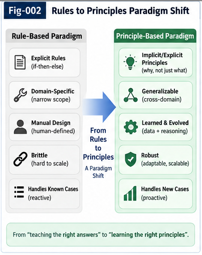

# PI-001 — From Rules to Principle Intelligence

## From Hand-Written Knowledge to Open Structural Learning

**Repository:** Principle Intelligence and Open Structural Learning
**Document:** PI-001
**Status:** v1.0.0
**Authors:** Sizhe Tan & GPT-Obot

---

## Abstract

Artificial intelligence has repeatedly changed the place where intelligence is assumed to reside.

Early symbolic systems placed intelligence in explicitly represented symbols, rules, logical relations, and programs. Rule engines and expert systems demonstrated that structured knowledge could be stored, inspected, composed, and executed. LISP went further by showing the computational power of treating symbolic expressions themselves as manipulable objects.

Modern statistical and neural systems shifted the center of gravity. Instead of requiring humans to specify most useful structures in advance, neural networks learned representations, correlations, predictors, policies, and increasingly rich latent structures from large amounts of data.

Both paradigms achieved something fundamental, but they left an important gap between them.

Symbolic systems provide explicit reusable structure but traditionally depend heavily on externally supplied concepts, rules, and ontologies.

Neural systems can discover rich regularities from experience, but much of the resulting intelligence remains folded into model parameters or latent representations and is therefore difficult to isolate, validate, transport, revise, and recombine as independent structural knowledge.

**Principle Intelligence** is proposed as one approach to this gap.

A Principle is not merely a hand-written rule, nor is it simply a statistical correlation hidden in model weights. It is a reusable structural invariant, constraint, directional relation, or regularity extracted from evidence and intended to remain useful beyond the observations from which it was derived.

Principle Intelligence therefore asks a different question:

> How can reusable structural knowledge emerge from experience, be explicitly represented, tested against supporting and counter-evidence, instantiated under different contexts, and become part of an open and growing intelligence system?

This document introduces the transition from rules to Principle Intelligence and positions Principle Intelligence as a bridge among symbolic computation, statistical learning, structural intelligence, and open-ended machine knowledge growth.

---

# 1. The Historical Problem

A recurring problem in artificial intelligence can be stated simply:

> Where does reusable knowledge come from?

Different generations of AI have answered this question differently.

A simplified historical progression is:

```text
Logic
  ↓
Symbolic Representation
  ↓
LISP
  ↓
Rule Engines
  ↓
Expert Systems
  ↓
Knowledge Bases
  ↓
Statistical Learning
  ↓
Neural Representation Learning
  ↓
Large Models / World Models
  ↓
Structural Learning
  ↓
Principle Intelligence
```

This progression should not be interpreted as a sequence in which each new paradigm invalidates the previous one.

Instead, each paradigm exposes a different layer of intelligence.

Logic formalized relations.

LISP demonstrated compositional symbolic computation.

Rule engines operationalized explicit knowledge.

Expert systems organized domain knowledge into executable decision structures.

Statistical learning allowed regularities to be inferred rather than manually specified.

Neural networks greatly expanded the scale and richness of learned representations.

World models increasingly learn predictive structure from interaction with environments.

Principle Intelligence asks what may come next:

> Can learned or observed experience itself produce explicit, reusable, testable, and evolvable structural knowledge?

---

# 2. What Rule-Based AI Got Right

Rule-based systems are sometimes discussed only through their limitations.

That misses their lasting contribution.

A rule such as:

```text
IF condition
THEN action
```

has several valuable properties.

It is identifiable.

It is inspectable.

It can be independently modified.

It can be reused.

It can be composed with other rules.

It can often be tested independently of the entire system.

These properties remain highly desirable even in the era of large neural models.

The deeper contribution of symbolic AI was therefore not merely that intelligence could be represented as rules.

It demonstrated a more general principle:

> **Intelligence structures can become explicit computational objects.**

Once intelligence is externalized into an identifiable structure, it becomes possible to inspect, exchange, revise, combine, govern, and preserve it.

This idea remains fundamental.

---

# 3. The LISP Legacy

LISP occupies a particularly important place in this history.

Its significance is larger than a particular programming syntax.

LISP helped demonstrate that programs and the structures manipulated by programs could share a common representational substrate.

Conceptually:

```text
Symbol
  ↓
List
  ↓
Expression
  ↓
Function
  ↓
Program
  ↓
Program manipulating program
```

This made symbolic structures unusually composable and reflective.

A program could manipulate expressions representing other computations.

This provided an early glimpse of an important idea:

> Computation does not have to operate only on raw numerical data. It can operate on structured representations of computation itself.

Principle Intelligence inherits this insight.

But it asks for something that classical symbolic systems could only partially provide:

> Where do the useful structures being manipulated come from?

---

# 4. The Knowledge Acquisition Bottleneck

A simplified traditional knowledge-engineering pipeline often looks like:

```text
Human Expert
     ↓
Human Interpretation
     ↓
Concept Definition
     ↓
Ontology
     ↓
Rule Construction
     ↓
Knowledge Base
     ↓
Inference Engine
```

The inference engine may be sophisticated.

The rules may be compositional.

The symbolic language may be expressive.

But much of the important structural intelligence has already been supplied before inference begins.

This creates the classical knowledge acquisition problem.

Humans must identify:

* relevant concepts,
* important conditions,
* useful abstractions,
* exceptions,
* relationships,
* causal assumptions,
* decision boundaries,
* and operational rules.

The machine reasons over a world that has already been substantially structured for it.

This is powerful when the domain is stable and experts can explicitly specify the relevant knowledge.

It becomes difficult when the environment is open, evolving, poorly understood, or too large for manual knowledge engineering.

---

# 5. Neural Learning Reversed the Direction

Statistical and neural learning changed the pipeline.

Instead of requiring most useful structure to be manually encoded first:

```text
World
  ↓
Data / Experience
  ↓
Learning
  ↓
Representation
  ↓
Prediction / Decision
```

This was a profound change.

The machine could now learn useful internal organization from experience.

Modern neural models can acquire:

* perceptual representations,
* semantic associations,
* temporal regularities,
* latent dynamics,
* behavioral patterns,
* predictive relationships,
* and complex distributed abstractions.

This substantially reduced the need to hand-author every intermediate concept and rule.

But it created a different problem.

Much of the acquired intelligence became difficult to separate from the model that learned it.

---

# 6. The Folded-Knowledge Problem

A trained model may contain extremely rich knowledge.

But that knowledge is often distributed across:

* parameters,
* embeddings,
* latent dimensions,
* activation patterns,
* attention structures,
* learned dynamics,
* and context-dependent computation.

The model may successfully use a regularity without exposing that regularity as an independent object.

Conceptually:

```text
Experience
    ↓
Large-Scale Learning
    ↓
Model Parameters
    ↓
Latent Intelligence
```

This intelligence is useful.

But it is frequently **folded intelligence**.

A reusable structural insight may exist implicitly without having:

* an independent identity,
* explicit scope,
* evidence provenance,
* counter-evidence,
* exceptions,
* a lifecycle,
* a portable interface,
* or a mechanism for independent revision.

This creates a new knowledge problem.

The old problem was:

> How do humans put enough knowledge into the machine?

The new problem increasingly becomes:

> How do we extract reusable intelligence from what machines have already learned or experienced?

---

# 7. From Knowledge Acquisition to Structural Extraction

Principle Intelligence begins from this inversion.

Traditional knowledge engineering:

```text
Human Knowledge
      ↓
Explicit Structure
      ↓
Machine Reasoning
```

Principle Intelligence:

```text
Experience
    ↓
Observation
    ↓
Difference
    ↓
Structural Evidence
    ↓
Candidate Principle
    ↓
Validation
    ↓
Reusable Structure
```

The important transition is:

> **Knowledge is not only inserted into the intelligence system. Knowledge structures can be extracted from its interaction with the world.**

This does not eliminate human knowledge.

Human knowledge can itself become evidence, prior structure, a candidate Principle, a validation source, or a competing hypothesis.

The key change is that human-authored knowledge is no longer the only possible root of explicit structure.

---

# 8. What Is a Principle?

For this framework, a preliminary definition is:

> **A Principle is a reusable structural invariant, constraint, directional relation, or regularity extracted from evidence and intended to remain useful beyond the observations from which it was derived.**

Several parts of this definition matter.

## 8.1 Reusable

A Principle should not merely memorize an individual observation.

It should support reasoning or action in additional contexts.

## 8.2 Structural

A Principle represents a relation among identifiable structures.

It is more than an isolated statistical score.

## 8.3 Evidence-Bound

A Principle has a relationship to the evidence from which it emerged.

It is not simply declared true.

## 8.4 Scope-Bound

A Principle may apply only under particular contexts, environments, scales, or assumptions.

## 8.5 Revisable

New evidence may strengthen, weaken, specialize, split, merge, or reject a Principle.

A Principle is therefore not equivalent to an eternal truth.

It is better understood as an evolvable structural hypothesis.

---

# 9. Rule and Principle Are Not the Same

A rule is commonly operational.

For example:

```text
Condition
    ↓
Action
```

or:

```text
Condition
    ↓
Conclusion
```

A Principle may instead describe a reusable structural relationship.

For example:

```text
Observed transitions:
A → B is inexpensive
B → A is expensive
```

A candidate Principle may be:

```text
Transition cost may be directional.
```

That Principle does not directly prescribe one action.

Instead, it can influence many downstream structures:

```text
Directional Transition Principle
            ↓
     Context Binding
            ↓
   ┌────────┼────────┐
   ▼        ▼        ▼
 CCC-A    CCC-B    CCC-C
   │        │        │
   ▼        ▼        ▼
Planning  Policy   Search
```

This distinction is important.

A Principle can act as a **generator or constraint of operational intelligence**.

---

# 10. Principle as a Knowledge Root

This suggests a useful distinction between a Knowledge Base and a Knowledge Root System.

A conventional Knowledge Base primarily asks:

> What knowledge is stored?

A Principle-oriented Knowledge Root System also asks:

> Where did this structure come from?

> What evidence supports it?

> What evidence challenges it?

> Under what context does it apply?

> What structures can be derived from it?

> What happens when new evidence conflicts with it?

> How has it changed over time?

Conceptually:

```text
                  Principle
                      │
        ┌─────────────┼─────────────┐
        ▼             ▼             ▼
     Evidence       Scope       Counter-Evidence
        │             │             │
        └─────────────┼─────────────┘
                      ▼
                  Validation
                      │
                      ▼
              Reusable Structure
                      │
        ┌─────────────┼─────────────┐
        ▼             ▼             ▼
       CCC          Trigger       Policy
```

The Principle is therefore not simply another record in a database.

It acts as a structural root from which additional intelligence may grow.

---

# 11. Sparse Evidence and Structural Leverage

Large-scale statistical learning is exceptionally effective when abundant representative data are available.

But many important intelligence problems involve:

* rare events,
* anomalies,
* failures,
* new environments,
* safety incidents,
* previously unseen structures,
* small numbers of critical observations,
* and asymmetric or highly contextual transitions.

In these cases, another form of leverage becomes important.

Instead of asking only:

> What statistical pattern dominates the sample distribution?

we can also ask:

> What changed?

> Which difference matters?

> Which constraint was violated?

> What remained invariant?

> Which observation contradicts the current explanation?

> Which transition reveals a directional relation?

This motivates a central hypothesis of Principle Intelligence:

> **As evidence becomes sparse, the value of explicit structural leverage can increase.**

This can be summarized as:

```text
Dense Evidence
     ↓
Statistical Regularity
     ↓
Model Learning
```

and:

```text
Sparse Critical Evidence
        ↓
Difference
        ↓
Constraint / Relation
        ↓
Candidate Principle
```

These are complementary rather than mutually exclusive learning regimes.

A future intelligent system may use both.

---

# 12. Difference Is Not Limited to Euclidean Difference

The word "difference" should be interpreted broadly.

A useful difference may exist in many spaces.

Examples include:

```text
Euclidean Difference
Metric Difference
Directional / Quasimetric Difference
Temporal Difference
Behavioral Difference
Trajectory Difference
Causal Difference
Policy Difference
Evidence Difference
Counterfactual Difference
Context-Bound Difference
```

Two observations may be visually similar but behaviorally distant.

Two states may be geometrically close but dynamically unreachable.

A transition may be cheap in one direction and expensive in the reverse direction.

Two trajectories may reach the same endpoint while differing dramatically in safety, energy cost, policy compliance, or reversibility.

Principle Intelligence therefore does not assume a single universal notion of similarity.

Instead:

> **The relevant difference is determined by the structure, context, dynamics, objective, and perspective of the intelligence problem.**

---

# 13. From Difference to Principle

A minimal Principle-extraction path can be expressed as:

```text
Observation
     ↓
Localization
     ↓
Difference Detection
     ↓
Critical Differential Evidence
     ↓
Candidate Relation
     ↓
Candidate Principle
```

For example:

```text
Observation 1:
A → B succeeds.

Observation 2:
B → A fails.

Observation 3:
A similar asymmetry appears elsewhere.
```

The system may propose:

```text
Candidate Principle:
Reachability may be directional.
```

The important point is not that three observations are always sufficient.

The important point is methodological:

> A small number of structurally informative observations can sometimes contain more useful information than a much larger collection of structurally redundant observations.

Principle Intelligence seeks mechanisms for recognizing and exploiting this structural information.

---



**Fig-002 — Rules to Principles Paradigm Shift.**  
The transition from predefined rules and stored knowledge toward evidence-driven formation, validation, and evolution of reusable structural Principles.

---

# 14. Principle Intelligence Is Not a Return to Classical Symbolic AI

It would be misleading to describe Principle Intelligence simply as a revival of symbolic AI.

The proposed pipeline is different.

Classical symbolic knowledge engineering often begins with:

```text
Predefined Symbols
       ↓
Predefined Relations
       ↓
Rules
       ↓
Inference
```

Principle Intelligence aims toward:

```text
Experience
    ↓
Learned / Observed Structure
    ↓
Difference
    ↓
Candidate Principle
    ↓
Explicit Structural Object
    ↓
Further Computation
```

The direction of knowledge formation has changed.

The symbolic structure may be an **output of learning**, rather than merely an input to reasoning.

---

# 15. Beyond a Closed Symbolic Vocabulary

There is an additional difference that becomes increasingly important in open intelligent systems.

Traditional symbolic systems usually operate over a substantially predefined vocabulary.

Principle Intelligence should not require that all future intelligence structures be known in advance.

A Principle may eventually need to operate over structures such as:

```text
Observation
Difference
Metric Relation
Trajectory
CCC
Two-Way CCC Result
Counter-Evidence
Trigger
Policy
Calling Graph
Another Principle
PIRP
PIRU
World-Model Output
Runtime-Generated Structure
```

Some of these structures may not exist when the Principle system is initially deployed.

They may be:

* discovered,
* generated,
* retrieved,
* composed,
* delegated,
* imported from another agent,
* or produced at runtime.

This leads toward a central idea developed in later documents of this repository:

> **The structural vocabulary of Principle Intelligence can itself grow.**

Principle Intelligence is therefore not only about learning new values inside a fixed representation.

It can participate in the growth of the representation space itself.

---

# 16. From Closed-Space Computation to Open Structural Learning

This distinction can be expressed as:

```text
Closed-Space Computation

Predefined State Space
        ↓
Predefined Objects
        ↓
Predefined Operators
        ↓
Search / Optimization
        ↓
Answer
```

Open Structural Learning aims toward:

```text
Experience
    ↓
Existing Structure
    ↓
Difference / Failure / Novelty
    ↓
New Structural Object
    ↓
Expanded Structural Space
    ↓
New Search / Reasoning Possibilities
```

This suggests an important distinction:

> **Optimization selects within a defined possibility space.**

while:

> **Open structural learning may extend the representational and computational space in which future selection occurs.**

The distinction does not eliminate optimization.

It places optimization inside a larger process of structural growth.

---

# 17. Principle Intelligence and LISP: Continuity and Difference

The relationship can now be stated more precisely.

LISP demonstrated:

> **Programs can manipulate programs and symbolic computational structures.**

Principle Intelligence seeks to extend this toward:

> **Intelligence can operate on intelligence structures, extract new structures from evidence, and generate additional structures required for future reasoning.**

This is both continuity and departure.

The continuity is compositional structural computation.

The departure is that the structural vocabulary and knowledge roots need not be fully supplied in advance.

Conceptually:

```text
LISP-like Structural Computation
             +
Learning from Experience
             +
Differential Extraction
             +
Evidence Validation
             +
Runtime Structural Growth
             ↓
      Principle Intelligence
```

Principle Intelligence should therefore be understood neither as anti-symbolic nor anti-neural.

It attempts to connect the strengths of both.

---

# 18. Structure Without Learning vs Learning Without Explicit Structure

A useful high-level comparison is:

```text
Classical Symbolic AI
---------------------
Explicit Structure
Composability
Inspectability
Rule Execution

Primary Limitation:
Knowledge acquisition
```

```text
Modern Neural AI
----------------
Experience-Driven Learning
Rich Representation
Large-Scale Generalization
Prediction

Primary Limitation for this discussion:
Much reusable intelligence remains implicit
or entangled inside the model
```

Principle Intelligence aims toward:

```text
Structural Learning
-------------------
Experience-Driven Structure Formation
Explicit Reusable Principles
Evidence Binding
Counter-Evidence
Context Binding
Composability
Revision
Portability
Structural Growth
```

The objective is not to choose between symbolic and neural intelligence.

The objective is to make learned intelligence increasingly available as reusable structure.

---

# 19. From Model Intelligence to Structural Intelligence

This suggests a broader architecture:

```text
WORLD
  │
  ▼
Observation / Interaction
  │
  ▼
Statistical / Neural Learning
  │
  ▼
Representation / World Model
  │
  ▼
Difference Detection
  │
  ▼
Principle Intelligence
  │
  ▼
CCC / Trigger / Policy
  │
  ▼
Portable Intelligence
  │
  ▼
Runtime Composition
  │
  ▼
Action
  │
  └────────────────────→ WORLD
```

The boundaries are not strict.

A neural model may itself discover useful geometry.

A Principle system may invoke neural models.

A world model may supply evidence to a Principle.

A Principle may modify planning objectives.

A runtime intelligence unit may call both structural and neural components.

The purpose of the architecture is not separation for its own sake.

It is to identify **where intelligence can become reusable structure**.

---

# 20. Principle Intelligence as Structural Externalization

One of the deepest transitions in the history of human civilization has been the externalization of intelligence.

Human knowledge moved from individual memory into:

* language,
* writing,
* diagrams,
* mathematics,
* books,
* scientific theories,
* legal systems,
* libraries,
* software,
* networks,
* and institutions.

Externalized intelligence can survive the individual who produced it.

It can be inspected by others.

It can be challenged.

It can be recombined.

It can accumulate.

Machine intelligence may require an analogous transition.

Model weights are powerful stores of learned capability, but they are not necessarily sufficient as the sole medium of cumulative machine knowledge.

Principle Intelligence explores one possible additional layer:

> **Explicit, evidence-bound, reusable structural knowledge extracted from intelligence and made available to intelligence.**

---

# 21. From Knowledge Base to Growing Knowledge Roots

This leads to a different model of machine knowledge.

Instead of:

```text
Knowledge Base
     ↓
Query
     ↓
Answer
```

consider:

```text
Experience
    ↓
Difference
    ↓
Principle Formation
    ↓
Validation
    ↓
Knowledge Root
    ↓
Derived Structures
    ↓
Action / Reasoning
    ↓
New Experience
    ↓
New Difference
    ↓
Principle Revision
```

The system does not merely accumulate more entries.

Its knowledge structures have histories.

They have supporting evidence.

They encounter counter-evidence.

They can produce descendants.

They can specialize.

They can be replaced.

They can participate in further Principle formation.

This is closer to a living knowledge ecology than a static knowledge repository.

---

# 22. Toward Collective Structural Learning

Once a Principle becomes explicit, identifiable, and sufficiently self-describing, another possibility appears:

> It may no longer need to remain inside the agent that discovered it.

A future pipeline may look like:

```text
Agent A
  ↓
Experience
  ↓
Principle Extraction
  ↓
Validation
  ↓
Portable Structural Intelligence
  ↓
Collective Intelligence Space
  ↓
Agent B
  ↓
Context Binding
  ↓
Reuse
  ↓
New Evidence
  ↓
Revision / Counter-Evidence
  ↓
Fold Back
```

This changes the unit of learning.

Learning is no longer limited to:

```text
one model
    ↓
one training process
    ↓
one set of weights
```

It may also occur through:

```text
many agents
    ↓
many experiences
    ↓
shared structural intelligence
    ↓
collective validation
    ↓
cumulative growth
```

Principle Intelligence therefore has a natural connection to portable intelligence structures and collective learning.

These connections are developed later in this repository.

---

# 23. What Principle Intelligence Does Not Claim

Several boundaries are important.

Principle Intelligence does **not** claim that:

* all intelligence should become symbolic;
* neural models should be replaced;
* large-sample statistical learning is unnecessary;
* a small number of observations always produces a valid Principle;
* extracted Principles are automatically true;
* one universal metric describes every relevant difference;
* every Principle should apply globally;
* explicit structures can represent every useful aspect of intelligence.

Instead, the proposal is narrower:

> **Some learned or observed intelligence can be externalized as reusable structural knowledge, and doing so may provide substantial leverage for sparse evidence, validation, transfer, composition, and collective growth.**

The important research problem is discovering when and how this transformation should occur.

---

# 24. Core Transition

The central transition introduced in this document can be summarized as:

```text
RULE ERA
Human
  ↓
Knowledge
  ↓
Rule
  ↓
Machine Execution
```

```text
MODEL ERA
World
  ↓
Data
  ↓
Training
  ↓
Model
  ↓
Prediction / Action
```

```text
PRINCIPLE INTELLIGENCE
World / Model / Agent
        ↓
Observation
        ↓
Difference
        ↓
Structural Evidence
        ↓
Candidate Principle
        ↓
Validation
        ↓
Reusable Structure
        ↓
Portable / Composable Intelligence
        ↓
Action
        ↓
New Evidence
        ↓
Structural Growth
```

The third does not replace the first two.

It connects them.

---

# 25. A Working Thesis

The working thesis of Principle Intelligence can therefore be stated as:

> **Intelligence should not be limited to executing predefined rules or storing learned regularities implicitly inside models. An intelligent system should also be able to extract reusable structural principles from experience, preserve their evidence and scope, test them against counter-evidence, compose them with existing and newly generated intelligence structures, and allow them to participate in continued structural growth.**

This turns Principle formation from a human-only knowledge-engineering activity into a candidate machine intelligence capability.

---

# 26. From Rules to Roots

The transition can finally be summarized in four stages.

### Stage 1 — Rules

Humans encode operational knowledge.

```text
Condition → Action
```

### Stage 2 — Models

Machines learn regularities from large amounts of experience.

```text
Experience → Model
```

### Stage 3 — Principles

Machines extract reusable structural relations from learned or observed experience.

```text
Experience → Difference → Principle
```

### Stage 4 — Open Structural Learning

Principles participate in the creation, validation, composition, and growth of further intelligence structures.

```text
Principle
   ↓
New Structure
   ↓
New Evidence
   ↓
New Principle
   ↓
Expanded Intelligence Space
```

The destination is therefore not merely a better rule engine.

It is a system in which explicit structural intelligence can itself emerge and evolve.

---

# 27. Conclusion

Symbolic AI demonstrated the power of explicit structure.

LISP demonstrated that computational structures could themselves become manipulable objects.

Rule engines demonstrated reusable operational knowledge.

Expert systems demonstrated domain-level structured reasoning.

Statistical and neural learning demonstrated that useful internal organization could emerge from experience rather than being entirely hand-authored.

Modern representation learning and world models have pushed this capability much further.

But an important opportunity remains between learned intelligence and reusable explicit intelligence.

Principle Intelligence addresses this opportunity.

Its central question is not simply:

> What rules should an intelligent system execute?

Nor only:

> What model should it train?

It asks:

> **What reusable structural Principles can intelligence discover from experience, how can those Principles be validated and revised, and how can they become building blocks for future intelligence?**

This leads from:

```text
Rules
```

to:

```text
Learned Representations
```

to:

```text
Extracted Principles
```

to:

```text
Open Structural Learning
```

and ultimately toward intelligence systems whose structural vocabulary, knowledge roots, and reusable computational objects can continue to grow.

The next step is therefore to examine the source material of Principle formation itself:

> **Sparse differential evidence.**

---

## Next Document

**PI-002 — Sparse Evidence, Differential Intelligence, and Principle Extraction**

The next document develops the hypothesis that small numbers of structurally informative differences, constraints, failures, asymmetries, and counterexamples can provide disproportionate leverage for Principle formation, and examines how differential evidence can be transformed into candidate reusable intelligence structures.

---

## Repository Thesis

> **Learn from experience.
> Extract the difference.
> Form the Principle.
> Test the structure.
> Preserve the evidence.
> Reuse the intelligence.
> Keep the structural space open for growth.**
