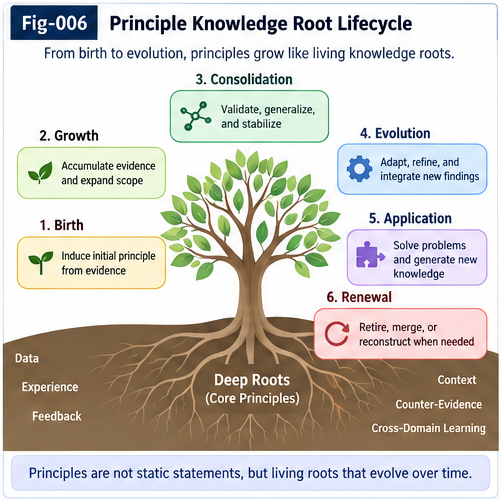

# PI-005 — Counter-Evidence and the Principle Lifecycle

## From Contradiction to Structural Localization, Revision, and Open-Ended Knowledge Growth

**Repository:** Principle Intelligence and Open Structural Learning
**Document:** PI-005
**Status:** v1.0.0
**Authors:** Sizhe Tan & GPT-Obot

---

## Abstract

A Principle Intelligence system cannot treat Principles as permanent truths merely because they were once useful, statistically supported, logically plausible, or successfully applied.

Reality continues to produce new evidence.

Some evidence supports an existing Principle.

Some narrows its scope.

Some reveals an exception.

Some exposes a hidden variable.

Some suggests an alternative explanation.

Some demonstrates that the Principle should be split.

Some supports merging several Principles into a more general structure.

And some evidence may justify rejecting the Principle entirely.

This document treats **counter-evidence** not merely as a rejection signal but as a source of structural intelligence.

The central pipeline is:

```text
Supporting Evidence
        vs
Counter-Evidence
        ↓
Structural Difference
        ↓
Counter-Evidence Delta
        ↓
Localization
        ↓
Principle Revision
```

The key question is therefore not simply:

> Is Principle P true or false?

A more productive question is:

> **What structural difference causes P to work here and fail there?**

This transforms contradiction into a learning mechanism.

A Principle may move through a lifecycle such as:

```text
Observation
    ↓
Candidate
    ↓
Supported
    ↓
Promoted
    ↓
Applied
    ↓
Challenged
    ↓
Revalidated
    ↓
Specialized / Split / Merged / Weakened / Replaced
    ↓
Deprecated / Rejected / Archived
```

Counter-evidence can therefore produce **structural differentiation** rather than merely deletion.

The resulting architecture supports a knowledge system that can grow while remaining corrigible.

Principles are neither immutable truths nor disposable guesses.

They are **evidence-bound, context-sensitive, revisable structural intelligence objects with explicit lifecycles**.

---

# 1. The Problem of Principle Permanence

A system that can extract Principles immediately faces a second problem:

> What happens after a Principle has been learned?

If the answer is:

```text
Store Principle
      ↓
Reuse Forever
```

then Principle Intelligence eventually becomes a rigid knowledge base.

That would reproduce one of the central weaknesses of classical rule systems.

The problem is not only learning Principles.

The system must also learn:

```text
when they apply

when they stop applying

where their boundaries lie

what exceptions matter

when they should be revised

when they should be replaced
```

Therefore:

> **Principle extraction without Principle lifecycle management is incomplete intelligence.**

---

# 2. A Principle Is Not a Permanent Truth

A Principle should be treated as:

> **an evidence-bound structural hypothesis intended for reuse within a defined or evolving scope.**

Conceptually:

```text
Principle P
│
├── Structural Statement
├── Scope
├── Context
├── Perspective
├── Evidence
├── Counter-Evidence
├── Exceptions
├── Provenance
├── Validation State
└── Lifecycle State
```

This is deliberately different from:

```text
P = TRUE
```

A Principle can be useful without being universal.

---

# 3. Principle Confidence Is Not Principle Identity

Suppose:

```text
P:
Transition cost can be directional.
```

The identity of P should not disappear every time confidence changes.

Instead:

```text
P
│
├── confidence = changing
├── evidence = growing
├── scope = evolving
└── lifecycle = evolving
```

This allows the system to preserve lineage while revising epistemic status.

---

# 4. Evidence Has Multiple Roles

Evidence should not be reduced to a single numeric vote.

An observation may provide:

```text
Supporting Evidence

Counter-Evidence

Scope Evidence

Boundary Evidence

Exception Evidence

Mechanism Evidence

Competing-Explanation Evidence

Falsifying Evidence
```

These roles have different structural meanings.

Therefore:

```text
Evidence Count
```

is not sufficient.

The system needs:

```text
Evidence Structure
```

---

# 5. Counter-Evidence Is Not Simply Negative Evidence

Suppose Principle P predicts:

```text
Under Context C,
A → B is easier than B → A.
```

A new observation finds:

```text
Under Context D,
A → B ≈ B → A.
```

A naive system might record:

```text
P failed.
```

But several explanations are possible:

```text
P is wrong.

P is too broad.

C and D differ in an important variable.

The metric changed.

The observation is noisy.

A hidden constraint disappeared.

A competing mechanism dominates in D.
```

Therefore counter-evidence is not self-interpreting.

It requires structural analysis.

---

# 6. The Most Important Question

When a Principle succeeds in one case and fails in another, Principle Intelligence should ask:

> **What is different between the supporting case and the counterexample?**

This changes the operation from:

```text
COUNT
```

to:

```text
COMPARE
```

and then:

```text
LOCALIZE
```

This is the foundation of Counter-Evidence Delta Intelligence.

---

# 7. Counter-Evidence Delta

Let:

```text
E+
```

represent supporting evidence.

Let:

```text
E-
```

represent counter-evidence.

Then the most informative object may be:

```text
Delta(E+, E-)
```

Conceptually:

```text
Supporting Case
       │
       │ compare
       ▼
Counter-Evidence Case
       │
       ▼
Structural Delta
```

The Delta may reveal the missing dimension.

---

# 8. Example: Directional Reachability

Suppose:

```text
Case A:
upper platform → ground = easy
ground → upper platform = difficult
```

supports:

```text
P:
Reachability can be directional.
```

Now consider:

```text
Case B:
room A → room B = easy
room B → room A = easy
```

This does not necessarily falsify P.

The structural difference may be:

```text
Case A:
gravitational height difference

Case B:
approximately level geometry
```

Thus the counterexample helps localize scope.

---

# 9. Counter-Evidence Can Discover Scope

The Principle may evolve from:

```text
P0:
Reachability is directional.
```

to:

```text
P1:
Reachability can become directional
under asymmetric transition constraints.
```

The counterexample has improved the Principle.

It has not merely reduced confidence.

This is a major distinction.

---

# 10. Counter-Evidence as Structural Localization

We therefore define:

> ## Counter-Evidence Structural Localization
>
> **The process of comparing supporting and challenging cases in order to identify the structural difference responsible for a Principle's change in validity, behavior, or applicability.**

The pipeline is:

```text
Principle P
     ↓
Supporting Evidence E+
     +
Counter-Evidence E-
     ↓
Structural Comparison
     ↓
Delta
     ↓
Localization
```

Localization determines where revision should occur.

---

# 11. Localization Before Rejection

A useful default discipline is:

```text
Counter-Evidence
      ↓
Localize
      ↓
Revise if possible
      ↓
Reject if necessary
```

rather than:

```text
Counter-Evidence
      ↓
Reject Principle
```

This does not protect Principles from falsification.

It protects the system from destroying useful structure unnecessarily.

---

# 12. The Structural Attribution Ladder

When a Principle-derived behavior fails, possible causes include:

```text
1. Observation error

2. Execution error

3. Context mismatch

4. Metric mismatch

5. Policy mismatch

6. CCC binding error

7. Missing structural condition

8. Principle scope error

9. Principle structural error
```

The exact ordering may vary by application.

But the principle is:

> **Find the smallest structural revision that explains the evidence before rewriting a larger reusable structure.**

---

# 13. Delta-Minimal Revision

This motivates:

> ## Delta-Minimal Revision
>
> Prefer the smallest structural change that explains both the previous supporting evidence and the new counter-evidence.

Suppose:

```text
P works in 99 contexts
```

and fails in one context containing feature X.

A reasonable candidate is:

```text
P + condition not-X
```

before:

```text
delete P
```

This is structurally conservative without being epistemically rigid.

---

# 14. Anti-Overreaction

Small-sample intelligence creates a danger:

A single observation can sometimes reveal a decisive structure.

But a single observation can also be noise.

Therefore Principle Intelligence must avoid both:

```text
Ignore rare evidence
```

and:

```text
Rewrite everything after one anomaly
```

The system needs structural significance analysis.

---

# 15. Structural Significance

A counterexample becomes especially important when it is:

```text
repeatable

high-confidence

causally localized

policy-relevant

safety-critical

structurally unique

prediction-discriminating
```

Thus evidence weight should depend on more than frequency.

---

# 16. One Counterexample Can Matter More Than Thousands of Confirmations

Suppose a Principle claims:

```text
All transitions of class X are reversible.
```

Thousands of reversible examples support it.

Then one verified transition is found that is irreversible.

If the Principle is universal, that one example is structurally decisive.

Therefore:

```text
Evidence Importance
    ≠
Evidence Frequency
```

This is one reason Principle Intelligence needs logic, Delta analysis, and structural semantics in addition to statistical aggregation.

---

# 17. Principle Type Matters

Different Principles require different validation logic.

For example:

```text
Universal Constraint
```

may be vulnerable to one decisive counterexample.

A:

```text
Probabilistic Regularity
```

is not.

A:

```text
Context-Bound Heuristic
```

may tolerate exceptions.

A:

```text
Safety Principle
```

may require conservative treatment of rare failures.

Therefore each Principle should expose its epistemic type.

---

# 18. Principle Epistemic Type

Possible types include:

```text
Invariant

Constraint

Directional Relation

Causal Candidate

Probabilistic Regularity

Heuristic

Boundary Condition

Policy Principle

Empirical Pattern
```

Different types imply different counter-evidence semantics.

This prevents one universal scoring scheme from distorting all Principles.

---

# 19. Principle Lifecycle

A Principle should have an explicit lifecycle.

A canonical lifecycle is:

```text
Observed Pattern
      ↓
Candidate
      ↓
Tested
      ↓
Supported
      ↓
Promoted
      ↓
Applied
      ↓
Challenged
      ↓
Revalidated
```

From there it may become:

```text
Specialized

Split

Merged

Weakened

Strengthened

Replaced

Deprecated

Rejected

Archived
```

This makes knowledge evolution explicit.

---

# 20. Candidate

A Candidate Principle is a newly extracted structural hypothesis.

It may arise from:

```text
Sparse Differential Evidence

Trajectory Comparison

Graph Minus

Counter-Evidence Delta

Model Prediction

Human Proposal

PIRU Output

Another Principle
```

Candidate status means:

> structurally interesting, not yet sufficiently validated.

---

# 21. Tested

A Candidate enters testing when the system actively seeks evidence.

```text
Candidate P
     ↓
Forward Prediction
     +
Reverse Search
     ↓
Evidence Acquisition
```

Testing may involve:

```text
existing data

simulation

runtime execution

experiment

counter-evidence search

external agent

human review
```

---

# 22. Supported

A Principle becomes Supported when evidence justifies further use within an explicit scope.

Supported does not mean universal truth.

It means:

```text
usable under current evidence
and declared conditions
```

This distinction should remain visible.

---

# 23. Promoted

Promotion grants a Principle greater reuse authority.

For example:

```text
Candidate
   ↓
Supported
   ↓
Promoted
```

Promotion may permit:

```text
automatic CCC generation

PIRP/PIRU packaging

registry publication

cross-agent reuse

default retrieval
```

Promotion therefore has operational consequences.

---

# 24. Promotion Requires More Than Confidence

A Principle may have high statistical confidence but poor portability.

Another may have moderate evidence but strong structural clarity.

Promotion criteria can include:

```text
Evidence Quality

Counter-Evidence Status

Scope Clarity

Reproducibility

Structural Stability

Provenance

Interface Quality

Policy Compatibility

Reuse Value
```

This prevents Principle lifecycle from becoming only a probability threshold.

---

# 25. Applied

A Promoted Principle enters runtime use.

```text
Principle
    ↓
Context Binding
    ↓
CCC
    ↓
Action / Prediction / Evaluation
```

Runtime use generates new evidence.

Thus deployment is not the end of learning.

It is another stage of validation.

---

# 26. Challenged

A Principle becomes Challenged when meaningful evidence conflicts with:

```text
its prediction

its scope

its assumptions

its derived CCCs

or its structural statement
```

Challenged is not equivalent to Rejected.

It means:

> further structural analysis is required.

---



**Fig-006 — Principle Knowledge Root Lifecycle.**  
A Principle is an evidence-bound and evolvable Knowledge Root rather than permanent truth. Supporting evidence, counter-evidence, new contexts, and structural Delta may promote, specialize, split, merge, weaken, replace, archive, or reopen it.

---

# 27. Revalidated

After challenge, the Principle may survive unchanged.

For example:

```text
Observed Failure
      ↓
Two-Way Search
      ↓
Execution Error Found
      ↓
Principle Unaffected
```

Then:

```text
Challenged
    ↓
Revalidated
```

This is why attribution matters.

---

# 28. Specialized

A Principle becomes Specialized when counter-evidence reveals a missing scope condition.

Example:

```text
P0:
Transition cost is directional.
```

becomes:

```text
P1:
Transition cost can become directional
under irreversible state changes.
```

This is not necessarily a loss.

It is increased precision.

---

# 29. Principle Specialization as Learning

Many learning systems equate improvement with broader generalization.

Principle Intelligence must also value:

```text
better boundary discovery
```

because a narrower Principle may be more reliable.

Thus:

> **Knowledge growth can occur through specialization as well as generalization.**

---

# 30. Split

A Principle should split when one statement hides multiple structural regimes.

Suppose:

```text
P:
A causes B.
```

Evidence reveals:

```text
Context X:
A → B

Context Y:
A → C
```

Then:

```text
P
↓
P-X
+
P-Y
```

may be better than adding increasingly complex exceptions to one object.

---

# 31. Principle Splitting

The split operation is:

```text
P
│
├── Evidence Cluster X
└── Evidence Cluster Y
        ↓
Structural Delta
        ↓
P-X + P-Y
```

The parent P may remain as:

```text
historical ancestor

abstract parent

or deprecated generalization
```

depending on semantics.

---

# 32. Merge

The reverse operation occurs when several Principles reveal a shared root.

Suppose:

```text
P1:
Irreversible deformation creates
reverse transition cost.
```

and:

```text
P2:
Irreversible information loss creates
reverse transition cost.
```

A candidate parent may emerge:

```text
P3:
Irreversible state change can create
directional transition cost.
```

Thus:

```text
P1 + P2
   ↓
Shared Structure
   ↓
P3
```

---

# 33. Merge Requires Preservation of Difference

A merge should not erase meaningful specialization.

A good structure may be:

```text
             P3
            /  \
          P1    P2
```

rather than:

```text
P1 + P2 → delete P1/P2
```

This preserves both abstraction and local precision.

---

# 34. Weakened

A Principle may remain useful while its claim strength decreases.

For example:

```text
Always
```

may become:

```text
Usually
```

or:

```text
Under conditions X and Y
```

This is **Principle Weakening**.

Weakening is preferable to binary rejection when supported by evidence.

---

# 35. Strengthened

The reverse can also occur.

Repeated evidence across diverse contexts may support a broader scope.

```text
P under X
    ↓
P under X,Y,Z
    ↓
Candidate broader P
```

But broader promotion should invite new counter-evidence search.

Generalization increases the surface area for failure.

---

# 36. Replacement

A Principle may be superseded by a structurally better one.

```text
P-old
   ↓
Counter-Evidence
   ↓
New Structure
   ↓
P-new
```

P-old should not necessarily disappear.

It may be retained for:

```text
provenance

historical comparison

rollback

dependency analysis
```

but removed from default active use.

---

# 37. Deprecated

A Deprecated Principle remains identifiable but should not normally generate new runtime behavior.

Reasons include:

```text
superseded

poor evidence

obsolete context

policy incompatibility

better alternative
```

Deprecation preserves history without preserving authority.

---

# 38. Rejected

A Principle should be Rejected when evidence strongly undermines its useful structural claim and no reasonable specialization or repair preserves it.

Rejected means:

```text
not active knowledge
```

not:

```text
erase all traces
```

Its history may remain valuable.

---

# 39. Archived

Archived Principles preserve:

```text
identity

lineage

evidence

counter-evidence

revision history

reason for retirement
```

This prevents the system from repeatedly rediscovering previously rejected ideas without recognizing their history.

---

# 40. Principle Death Is Part of Intelligence

An intelligence system that can only accumulate knowledge but cannot retire it will eventually suffer structural overload.

Therefore:

> **Principle death is a normal component of Principle Intelligence.**

Growth includes:

```text
Birth

Differentiation

Reuse

Revision

Replacement

Death
```

This is closer to an evolving ecology than an append-only database.

---

# 41. Principle Lifecycle Graph

A more complete lifecycle can be represented as:

```text
                 Candidate
                    │
                    ▼
                  Tested
                    │
                    ▼
                 Supported
                    │
                    ▼
                 Promoted
                    │
                    ▼
                  Applied
                    │
                    ▼
                Challenged
                    │
        ┌───────────┼───────────┐
        ▼           ▼           ▼
   Revalidated  Specialized    Split
        │           │           │
        │           ▼           ▼
        │        Promoted    New Principles
        │
        ├───────────────┐
        ▼               ▼
     Weakened         Strengthened
        │               │
        └───────┬───────┘
                ▼
              Applied

Other transitions:

Multiple Principles
       ↓
      Merge

Principle
       ↓
   Replacement
       ↓
   Deprecated
       ↓
     Archived

or:

Principle
       ↓
    Rejected
       ↓
    Archived
```

The lifecycle is a graph, not a simple line.

---

# 42. Lifecycle Transitions Need Evidence

A Principle should not move states arbitrarily.

Each transition should preserve:

```text
Triggering Evidence

Decision Method

Responsible Evaluator

Timestamp / Version

Previous State

New State

Reason
```

This creates auditable knowledge evolution.

---

# 43. Principle Revision Record

A revision object might conceptually contain:

```text
Revision {
    principle_id

    previous_version
    new_version

    triggering_evidence
    counter_evidence

    structural_delta

    revision_type

    evaluator
    provenance

    validation_result
}
```

This turns Principle evolution into explicit structural history.

---

# 44. Versioning

A Principle should be versionable.

For example:

```text
P17-v1
    ↓
P17-v2
    ↓
P17-v3
```

Dependencies may specify:

```text
requires P17 >= v2
```

or bind to a particular version when reproducibility matters.

This becomes important for Collective Learning.

---

# 45. Principle Lineage

Revision can create lineage:

```text
P1
│
├── P1.1
│
└── P1.2
      │
      └── P1.2.1
```

Merge can create:

```text
P2 ──┐
     ├── P4
P3 ──┘
```

Replacement can create:

```text
P5 → P6
```

The result is a Principle dependency and evolution graph.

---

# 46. Principle Genome

A useful analogy is that a Principle has a structural genome:

```text
Identity

Core Statement

Scope

Context

Dependencies

Evidence Roots

Exceptions

Interfaces

Lifecycle History
```

Revision changes some parts while preserving lineage.

The analogy is architectural, not biological equivalence.

---

# 47. Core + Delta Principle Evolution

Principle versions can often be represented conceptually as:

```text
P-new
=
P-core
+
Delta
```

For example:

```text
P-core:
Transition cost may be directional.
```

Delta:

```text
under irreversible state change
```

produces a more specialized Principle.

This reduces unnecessary rewriting.

---

# 48. Difference as Revision Unit

This suggests:

> **The natural unit of Principle evolution may often be the structural Delta rather than the entire Principle.**

Instead of storing:

```text
entirely new Principle
```

the system may preserve:

```text
Parent Principle
+
Revision Delta
```

This improves lineage and explainability.

---

# 49. Counter-Evidence Delta Intelligence

We can now formalize the central process:

```text
Evidence E+
      +
Counter-Evidence E-
      ↓
Structural Comparison
      ↓
Delta
      ↓
Candidate Explanation
      ↓
Two-Way Validation
      ↓
Principle Revision
```

This is **Counter-Evidence Delta Intelligence** applied to Principle lifecycle management.

---

# 50. Counter-Evidence Is Often a Branch Generator

Suppose:

```text
P works under C1
P fails under C2
```

and:

```text
Delta(C1,C2) = X
```

Then X may generate a branch:

```text
             P
            / \
         X=yes X=no
          │     │
         P1     P2
```

Thus counter-evidence can create new structural topology.

---

# 51. From Exception List to Structural Branch

Traditional systems may handle failure by adding:

```text
EXCEPT case A
EXCEPT case B
EXCEPT case C
```

This can become brittle.

Principle Intelligence should ask whether exceptions share a structure.

```text
Exceptions
    ↓
Compare
    ↓
Common Delta X
    ↓
New Branch
```

This converts exception accumulation into learning.

---

# 52. Exception Compression

Suppose five exceptions all contain:

```text
low-friction surface
```

Instead of five exceptions:

```text
Exception 1
Exception 2
Exception 3
Exception 4
Exception 5
```

the Principle may evolve to:

```text
P applies when friction > threshold F
```

The exception set has been compressed into a structural condition.

---

# 53. Counter-Evidence Can Generate a New Principle

Sometimes the counterexample reveals not merely an exception but a second regularity.

```text
Evidence supporting P
       vs
Counterexample cluster
       ↓
Delta
       ↓
New recurring structure
       ↓
Candidate Principle Q
```

Thus:

```text
Counter-Evidence
      ↓
New Principle
```

is a normal growth path.

---

# 54. Failure Can Increase the Principle Count

This produces a seemingly paradoxical result:

```text
One Principle fails
       ↓
Two better Principles emerge
```

Knowledge has grown because the original representation was too coarse.

Therefore failure is not necessarily loss of intelligence.

It can be **structural differentiation**.

---

# 55. Principle Ecology

As Principles evolve, the system develops:

```text
parents

children

siblings

competitors

specializations

replacements

dependencies
```

This is better described as a:

> **Principle Ecology**

than as a flat Principle database.

---

# 56. Competition Between Principles

Two Principles may compete to explain the same evidence.

```text
Observation O
   ↑       ↑
  P1      P2
```

The system should not necessarily choose one immediately.

It can preserve:

```text
P1 = candidate explanation

P2 = competing explanation
```

until discriminating evidence appears.

---

# 57. Competing Principles Prevent Premature Closure

If the system immediately collapses:

```text
P1 vs P2
```

into:

```text
winner = P1
```

it may destroy useful uncertainty.

Instead:

```text
P1
P2
 ↓
Discriminating Evidence Needed
```

preserves an open branch.

This is important for sparse-evidence reasoning.

---

# 58. Two-Way Search for Discriminating Evidence

Given competing Principles:

```text
P1
P2
```

Two-Way CCC can ask:

```text
What observation would differ
if P1 were correct versus P2?
```

This produces:

```text
Discriminating Evidence Target
```

The target can guide:

```text
search

simulation

experiment

runtime observation
```

---

# 59. Active Counter-Evidence Search

A mature Principle system should not only receive counter-evidence accidentally.

It should sometimes seek it.

```text
Principle P
    ↓
Generate Candidate Failure Conditions
    ↓
Search / Experiment
    ↓
Counter-Evidence
```

This is:

> **Active Counter-Evidence Search**

and is central to avoiding self-confirming knowledge systems.

---

# 60. Principle Self-Critique

A Principle can expose:

```text
What supports me?

What assumptions do I depend on?

What would challenge me?

What contexts have not been tested?

What competing Principles exist?
```

This turns self-critique into a structural interface rather than a vague linguistic instruction.

---

# 61. Counter-Evidence API

A conceptual Principle API may include:

```text
getSupportingEvidence()

getCounterEvidence()

getUntestedContexts()

getKnownExceptions()

getCompetingPrinciples()

generateCounterEvidenceTargets()

requestCounterEvidenceSearch()

compareEvidenceStructures()
```

The exact implementation may vary.

The architectural point is explicit support for challenge.

---

# 62. Counter-Evidence Is First-Class Intelligence

Counter-evidence should be portable and reusable.

For example:

```text
CounterEvidenceObject {
    identity
    target_principle
    context
    observation
    expected_result
    actual_result
    structural_delta
    provenance
    confidence
}
```

This allows counter-evidence to participate directly in Open-LHS reasoning.

---

# 63. Counter-Evidence Can Be a PIRP

A reusable counter-evidence pattern may become a PIRP.

For example:

```text
PIRP:
Irreversibility Counter-Test
```

could test Principles involving reversible transitions.

Then:

```text
Principle
   +
Counter-Test PIRP
   ↓
Validation
```

This externalizes critique as portable intelligence.

---

# 64. Counter-Evidence Can Be a PIRU

A richer PIRU may actively:

```text
generate test cases

run simulation

search historical evidence

compare trajectories

produce Counter-Evidence Delta

return validation report
```

Thus critique itself can become an executable intelligence unit.

---

# 65. Principle Validation as an Ecosystem

Validation need not be centralized.

A Principle may be tested by:

```text
Agent A

PIRU B

Simulation C

Human D

Runtime E
```

Each produces evidence objects.

The Principle accumulates a distributed evidence graph.

This is naturally compatible with Collective Learning.

---

# 66. Independent Evidence Matters

Evidence derived from the same root should not be counted as independent confirmation.

Suppose:

```text
P → P1 → P2
```

and P2 is used to support P.

This creates circularity.

Therefore evidence objects should preserve derivation ancestry.

---

# 67. Circular Support

A dangerous structure is:

```text
P1 supports P2

P2 supports P3

P3 supports P1
```

without external evidence.

The graph may look richly connected while containing no independent grounding.

Therefore:

> **Structural connectivity is not equivalent to evidential independence.**

---

# 68. Evidence Root Analysis

A validation system should be able to trace:

```text
Principle P
   ↓
Evidence E1
   ↓
Source S1
```

and:

```text
Evidence E2
   ↓
Source S1
```

Then E1 and E2 may not represent two independent roots.

This is particularly important in Collective Learning where many agents may repeat the same upstream claim.

---

# 69. Collective Learning Can Amplify Error

Portable intelligence creates enormous reuse value.

It also creates amplification risk.

A flawed Principle can propagate:

```text
Agent A
   ↓
PIRU
   ↓
Agent B
   ↓
Derived Principle
   ↓
Agent C
   ↓
Further Reuse
```

Without provenance, repetition can be mistaken for independent confirmation.

Therefore Collective Learning requires counter-evidence infrastructure.

---

# 70. Collective Learning Needs Collective Criticism

A healthy collective intelligence system needs both:

```text
Knowledge Distribution
```

and:

```text
Knowledge Challenge
```

Therefore:

> **Collective Learning without Collective Criticism risks becoming Collective Error Amplification.**

Counter-evidence must travel as easily as Principles do.

---

# 71. Portable Counter-Evidence

If Principle P is published as portable intelligence, then evidence challenging P should also be publishable.

Conceptually:

```text
Principle P
│
├── Supporting Evidence
├── Counter-Evidence
├── Known Exceptions
└── Revision History
```

Receiving agents should not receive only the successful story.

They should receive the epistemic state.

---

# 72. Principle Package

A portable Principle package might contain:

```text
Principle Package
│
├── Principle Core
├── Scope
├── Context
├── Evidence+
├── Evidence-
├── Exceptions
├── Competing Principles
├── CCC Templates
├── Validation Methods
├── Provenance
└── Lifecycle State
```

This is richer than transporting a rule.

---

# 73. Principle Promotion Across Agents

A Principle that works for Agent A should not automatically become globally promoted.

Possible progression:

```text
Local Candidate
      ↓
Local Supported
      ↓
Portable Candidate
      ↓
Cross-Context Validation
      ↓
Collectively Supported
```

This distinguishes local success from broad reuse.

---

# 74. Context Diversity Matters

A Principle tested 1,000 times in one narrow context may have less portability evidence than one tested across:

```text
different environments

different agents

different tasks

different time periods

different implementations
```

Thus evidence diversity can matter alongside evidence volume.

---

# 75. Principle Portability Frontier

A useful concept is the:

> **Principle Portability Frontier**

A Principle may be known to work across some structural region:

```text
Context Space
│
├── validated
├── partially validated
└── unknown
```

The boundary between validated and unknown contexts is a natural target for future testing.

---

# 76. Boundary Testing

Instead of repeatedly testing the center of known success, the system can target the boundary.

```text
Known Valid Region
       │
       │ boundary
       ▼
Unknown Region
```

Counter-evidence is often most informative near this frontier.

This makes validation more efficient.

---

# 77. Principle Frontier Expansion

If boundary tests succeed:

```text
Validated Region
      ↓
Expand
```

If they fail:

```text
Boundary Failure
      ↓
Structural Delta
      ↓
Scope Refinement
```

Either outcome produces useful intelligence.

---

# 78. Anti-Goodhart Principle Validation

If Principle promotion depends on one scalar score, systems may optimize toward that score rather than robust knowledge.

For example:

```text
Promotion Score > threshold
```

can encourage structures that maximize the metric without improving real validity.

Therefore validation should use multiple evidence dimensions.

---

# 79. Rich Evaluator Pool

A Principle can be evaluated through:

```text
Prediction Accuracy

Counter-Evidence Robustness

Scope Stability

Cross-Context Reuse

Causal Consistency

Policy Compatibility

Safety Performance

Structural Simplicity

Independent Evidence
```

No single evaluator must dominate all Principles.

This connects Principle Intelligence to rich evaluator architectures.

---

# 80. Evaluators Can Disagree

Suppose:

```text
Predictive Evaluator = strong

Safety Evaluator = weak

Portability Evaluator = uncertain
```

The system should preserve this structure.

It should not necessarily compress it immediately into:

```text
confidence = 0.73
```

A vector of evaluations may preserve more useful information.

---

# 81. Principle State Is Multi-Dimensional

Instead of:

```text
Principle Confidence = x
```

a richer state may be:

```text
Principle State {
    empirical_support
    counter_evidence_strength
    scope_clarity
    portability
    safety_status
    provenance_quality
    validation_diversity
}
```

This reduces false precision.

---

# 82. Lifecycle Policy

Different applications can use different lifecycle policies.

A research system may allow:

```text
provisional Principle use
```

while a safety-critical system may require:

```text
multiple independent validation roots
```

before runtime activation.

Thus lifecycle policy should remain separate from Principle content.

---

# 83. Principle vs Policy

A Principle may state:

```text
Action A reduces cost.
```

Policy may require:

```text
Do not execute A without human approval.
```

Counter-evidence about the Principle and policy restrictions on action are different objects.

The architecture should not confuse:

```text
Is it structurally valid?
```

with:

```text
Is it permitted?
```

---

# 84. Lifecycle Governance

Some lifecycle transitions may be automated:

```text
Candidate → Tested
```

Others may require stronger governance:

```text
Promoted → Global Default
```

or:

```text
Safety Principle → Deprecated
```

Thus Principle lifecycle itself may be policy-governed.

---

# 85. Principle Sandbox

New Principles can begin in a sandbox.

```text
Candidate
   ↓
Sandbox
   ↓
Simulation
   ↓
Counter-Evidence Search
   ↓
Limited Runtime
   ↓
Promotion
```

This allows open growth without immediate unrestricted influence.

---

# 86. Revision Sandbox

Major Principle revisions can also be tested alongside the existing version.

```text
P-v1
  │
  ├── production
  │
P-v2
  │
  └── sandbox
```

Comparative runs can generate evidence.

This is analogous to A/B testing but applied to structural intelligence.

---

# 87. Principle A/B Validation

Suppose:

```text
P-v1
```

and:

```text
P-v2
```

generate different CCCs.

Run both against matched contexts:

```text
Context Set
   ↓
P-v1 CCCs
vs
P-v2 CCCs
   ↓
Outcome Delta
```

This provides direct structural revision evidence.

---

# 88. Revision Should Be Reversible

A new Principle version may later prove worse.

Therefore:

```text
P-v1
 ↓
P-v2
```

should not require destroying v1.

Rollback preserves resilience.

This is especially important in autonomous structural growth.

---

# 89. Principle History Is Intelligence

The failed versions of a Principle can themselves be useful.

They reveal:

```text
what was tried

why it failed

which contexts caused failure

which counter-evidence mattered
```

Therefore:

> **The history of Principle evolution is itself structural intelligence.**

---

# 90. Failed Principles Can Prevent Repeated Mistakes

If a system archives:

```text
Rejected Principle P
+
Reason R
+
Counter-Evidence E
```

then another agent proposing P can retrieve that history.

Instead of rediscovering the same failure:

```text
New Candidate P
      ↓
Search Principle History
      ↓
Prior Rejection Found
      ↓
Inspect New Delta
```

This accelerates Collective Learning.

---

# 91. Rediscovery Is Not Always Redundant

A previously rejected Principle may become valid under a new context.

Therefore archival retrieval should ask:

```text
Is the new candidate identical?

Or has context changed?

Or is new evidence available?
```

This preserves openness.

History should inform future reasoning, not freeze it.

---

# 92. Principle Resurrection

A deprecated or rejected Principle may be reconsidered if:

```text
new evidence appears

context changes

measurement improves

new structural objects become available

old counter-evidence is invalidated
```

Thus the lifecycle can include:

```text
Archived
   ↓
Reopened
   ↓
Candidate
```

Knowledge death need not be irreversible.

---

# 93. Open-LHS Changes Principle Lifecycle

Open-LHS makes lifecycle evolution especially powerful because new structural types can appear after a Principle was created.

A Principle may originally fail because the system lacked:

```text
Metric M
```

Years later:

```text
New PIRU-M
```

becomes available.

Then:

```text
Archived Principle P
      +
PIRU-M
      ↓
Re-evaluation
```

may produce a new result.

The growth of the representational ecosystem can change the fate of old knowledge.

---

# 94. Runtime Structural Generation Changes Falsification

A Principle may appear unsupported because the system cannot yet observe the relevant structure.

Two-Way search may ask for X.

If X does not exist:

```text
Missing X
   ↓
Runtime Structural Generation
   ↓
X
   ↓
New Test
```

Therefore some apparent uncertainty is actually:

```text
representation insufficiency
```

rather than lack of reality structure.

---

# 95. Principle Lifecycle and Representational Growth Co-Evolve

We therefore have two evolving systems:

```text
Principle Space
```

and:

```text
Structural Vocabulary Space
```

They interact:

```text
New Principle
     ↓
Needs New Structure
     ↓
Vocabulary Growth
     ↓
New Evidence
     ↓
Principle Revision
```

Thus:

> **Knowledge evolution and representational evolution can co-evolve.**

---

# 96. From Knowledge Base to Knowledge Root System

A traditional knowledge base emphasizes:

```text
Store Facts
Store Rules
Query
```

Principle Intelligence emphasizes:

```text
Extract Roots
Test Roots
Grow Branches
Discover Boundaries
Split Roots
Merge Roots
Retire Roots
Reuse Roots
```

This is better described as a:

> **Knowledge Root System**

than a static knowledge base.

---

# 97. From Knowledge Root System to Knowledge Ecology

Once Principles interact with:

```text
CCCs

PIRPs

PIRUs

Evidence

Counter-Evidence

Policies

Metrics

Agents
```

the system becomes more than a root hierarchy.

It becomes an evolving ecology.

```text
Principles
   ⇄
CCCs
   ⇄
Runtime
   ⇄
Evidence
   ⇄
Agents
   ⇄
Portable Intelligence
```

The ecology grows through both creation and correction.

---

# 98. The Principle Lifecycle Grand Loop

The complete loop can be represented as:

```text
                     WORLD
                       │
                       ▼
                  Observation
                       │
                       ▼
                   Difference
                       │
                       ▼
              Candidate Principle
                       │
                       ▼
                    Tested
                       │
                       ▼
                   Supported
                       │
                       ▼
                   Promoted
                       │
                       ▼
               Context Binding
                       │
                       ▼
                      CCC
                       │
                       ▼
              Runtime / Experiment
                       │
                       ▼
                    Outcome
                       │
                       ▼
              Evidence Comparison
                       │
             ┌─────────┴─────────┐
             ▼                   ▼
        Supporting          Counter-Evidence
        Evidence                  │
             │                    ▼
             │            Structural Delta
             │                    │
             │                    ▼
             │               Localization
             │                    │
             └──────────┬─────────┘
                        ▼
                Two-Way Validation
                        │
        ┌───────────────┼────────────────┐
        ▼               ▼                ▼
   Revalidate       Specialize         Split
        │               │                │
        │               ▼                ▼
        │          Revised P         P1 + P2
        │
        ├───────────────┬────────────────┐
        ▼               ▼                ▼
      Merge          Replace          Reject
        │               │                │
        └───────────────┼────────────────┘
                        ▼
                   Fold Back
                        │
                        ▼
              Principle Ecology
                        │
                        ▼
              Collective Learning
                        │
                        └──────────────→ WORLD
```

---

# 99. Seven Lifecycle Principles

The architecture can be compressed into seven principles.

## 1. Evidence-Bound

> A Principle remains connected to the evidence from which it emerged.

## 2. Counter-Evidence-Open

> A Principle must remain structurally capable of receiving evidence against itself.

## 3. Delta-Oriented

> When evidence conflicts, compare structures before merely counting outcomes.

## 4. Localization-First

> Find the smallest structural source of failure before revising larger reusable structures.

## 5. Revision-Capable

> Principles may specialize, split, merge, weaken, strengthen, or be replaced.

## 6. Lineage-Preserved

> Revision should preserve provenance and structural history.

## 7. Mortality-Permitted

> Principles may be deprecated, rejected, archived, and—when new evidence justifies it—reopened.

Together:

```text
Evidence
   +
Criticism
   +
Revision
   +
Memory
   ↓
Living Structural Knowledge
```

---

# 100. Conclusion

Principle Intelligence requires more than Principle extraction.

A system that learns reusable Principles but cannot revise them will eventually become rigid.

A system that discards Principles whenever a counterexample appears will fail to preserve useful structure.

The more productive approach is to treat counter-evidence as a source of structural information.

The central question becomes:

> **What is structurally different between the cases where the Principle works and the cases where it does not?**

That question creates the pipeline:

```text
Supporting Evidence
        vs
Counter-Evidence
        ↓
Structural Delta
        ↓
Localization
        ↓
Principle Revision
```

Revision may lead to:

```text
Revalidation

Specialization

Split

Merge

Weakening

Strengthening

Replacement

Deprecation

Rejection
```

Counter-evidence therefore does not merely destroy knowledge.

It can differentiate knowledge.

It can discover scope.

It can expose hidden conditions.

It can generate new branches.

It can reveal competing Principles.

It can trigger experiments.

It can cause new structural objects to be generated.

And it can produce entirely new Principles.

This leads to a central proposition:

> **A mature intelligence system should not merely know how to form a Principle. It should know how to let reality change the Principle.**

Principles should therefore be understood as living structural intelligence objects:

```text
born from evidence

tested by reality

challenged by counter-evidence

localized through Delta

revised through structure

preserved through lineage

shared through portable intelligence

and retired when they no longer deserve authority.
```

The resulting system is neither a static rule base nor an endlessly retrained opaque model.

It is an evolving **Principle Ecology**.

And its growth depends as much on its ability to preserve disagreement, contradiction, failure, and counter-evidence as on its ability to discover successful patterns.

---

## Next Document

**PI-006 — Principle to Context Binding, CCC Generation, and Portable Intelligence**

The next document moves from Principle lifecycle into deployment and Collective Learning.

Its central path is:

```text
Principle
    ↓
Context Binding
    ↓
Metric / Policy / Trigger Binding
    ↓
CCC Generation
    ↓
PIRP / PIRU Packaging
    ↓
Portable Runtime Intelligence
    ↓
Cross-Agent Reuse
    ↓
Runtime Evidence
    ↓
Principle Lifecycle
```

The central question becomes:

> **How does a Principle leave the environment in which it was discovered and become portable, context-bindable, executable, criticizable intelligence for another runtime?**

---

## Repository Thesis

> **Do not protect a Principle from counter-evidence.
> Preserve the counter-evidence with it.
> Compare where it works with where it fails.
> Extract the Delta.
> Localize the missing structure.
> Revise the Principle rather than merely changing its score.
> Let useful Principles specialize, split, merge, and travel.
> Let failed Principles leave a history.
> Let reality remain upstream of authority.**
